# Write-up – Bleuet de France v4

_Type : CTF OSINT  
Date : Mai 2025  
Classement 🥇 : Pas de résultat attendu, CTF historique et mémoriel_

_Réalisé en solo sous le nom d'équipe **OneForAll** (même si je dis nous/je/on)_

_Tous les flags ne sont pas dans le meilleur ordre possible, mais c'est l'ordre dans lequel je les ai trouvés._

## 📌 Sommaire

- [Une aide bienvenue](#1-une-aide-bienvenue)
- [Toute une histoire pour obtenir de l'aide...](#2-toute-une-histoire)
- [Memoire canadienne](#3-memoire_canadienne)
- [Une memoire chiffree 1](#4-une-memoire-chiffree-1)
- [Honneur et reconnaissance](#5-honneur-et-reconnaissance)
- [Sur la route de koufra](#6-sur_la-route-de-koufra)
- [Rue_du passe](#7-rue-du-passe)
- [Liberte egalite fraternite](#8-liberte-egalite-fraternite)
- [Une memoire chiffree 2](#9-une-memoire-chiffree-2)
- [Ops Armada](#10-ops-armada)
- [Derriere les masques](#11-derriere-les-masques)
- [A la recherche du vaisseau perdu](#12-a-la-recherche-du-vaisseau-perdu)
- [La derniere bataille de Jeanne](#13-la-derniere-bataille-de-jeanne)
- [Combattants du desert](#14-combattants-du-desert)
- [Pas besoin de vous faire un dessin](#15-pas-besoin-de-vous-faire-un-dessin)
- [Heure de partir](#16-heure-de-partir)
- [Aux origines du CTF 1](#17-aux-origines-du-ctf-1)
- [Shadow of the soldier](#18-shadow-of-the-soldier)
- [Parachutage en zone interdite](#19-parachutage-en-zone-interdite)
- [Soldat inconnu](#20-soldat-inconnu)
- [Une histoire cryptee](#21-une-histore-cryptee)
- [Sur les pas de la 2e DB](#22-sur-les-pas-de-la-2e-db)
- [Campagne Allemagne](#23-campagne-allemagne)
- [Grotte oubliee histoire retrouvee](#24-grotte-oubliee-histoire-retrouvee)
- [On y danse tous en rond](#25-on-y-danse-tous-en-rond)
- [Du sang et des larmes](#26-du-sang-et-des-larmes)
- [M-209](#27-m-209)
- [Aux origines du CTF 2](#28-aux-origine-du-ctf-2)
- [Techniques utilisees](#techniques-utilisees)
  
### 1. Une aide bienvenue

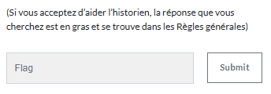

> On trouve le réglement et on rentre le flag.

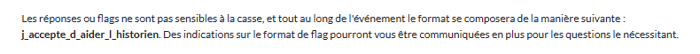

**🎯 Flag :** `j_accepte_d_aider_l_historien`

---

### 2. Toute une histoire pour obtenir de l'aide...

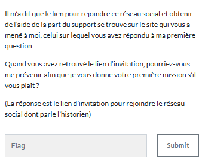

> Le flag est donc le lien du discord.
> 
**🎯 Flag :** `(le lien a changé)`

---

### 3. Memoire canadienne

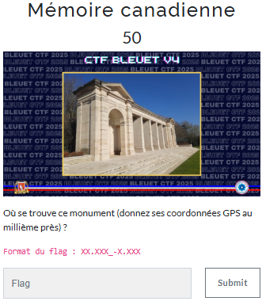

> Recherche inversée sur l'image qui nous indique que c'est le Monument du Mémorial de Bayeux.
> On va donc voir sa position sur Maps et on la recopie pour le flag comme indiqué.

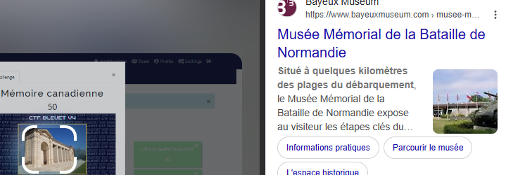

**🎯 Flag :** `49.274_-0.713`

---

### 4. Une memoire chiffree 1

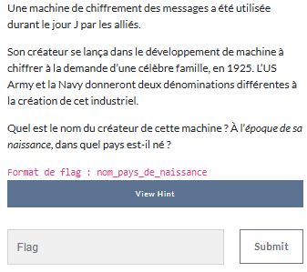

> En demandant à ChatGPT on a directement la réponse

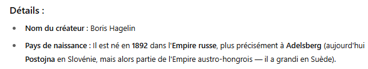

**🎯 Flag :** `hagelin_empire_russe`

---

### 5. Honneur et reconnaissance

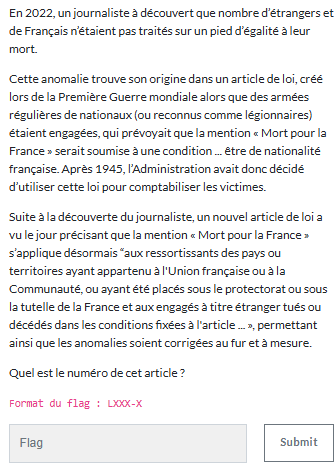

> ChatGPT one more time

**🎯 Flag :** `L511-2`

---

### 6. Sur la route de koufra

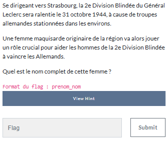

> Là encore ChatGPT nous donne la réponse.

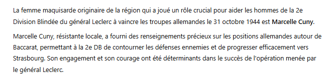

**🎯 Flag :** `marcelle_cuny`

---

### 7. Rue_du passe

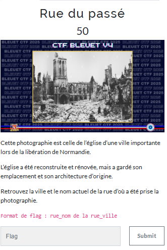

> Encore une fois un reverse image.
> On trouve rapidement que c'est l'église de la ville de Caen, et en se promenant sur Maps pour essayer de trouver la rue on finit par trouver le bon angle.

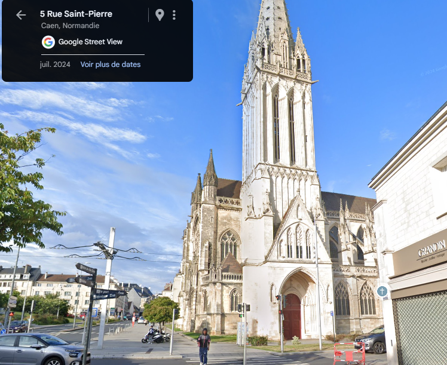

**🎯 Flag :** `rue_saint-pierre_caen`

---

### 8. Liberte egalite fraternite

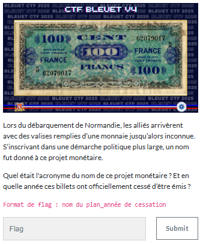

> Dans un premier temps ChatGPT nous donne le nom du projet, AMGOT.

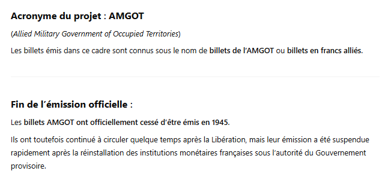

> Mais connaissant sa fiabilité sur ce genre de date il faut croisée avec une autre donnée.
> En cherchant sur Internet on finit par tomber sur le [bon site](https://museedelaresistanceenligne.org/media811-Billet-de-banque-AMGOT-recto-verso).
> On regarde le contexte historique et on trouve 1947.

**🎯 Flag :** `1947`

---

### 9. Une memoire chiffree 2

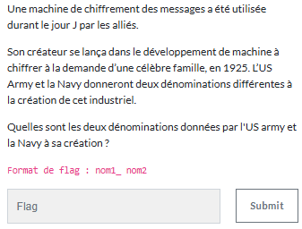

> Encore ChatGPT.

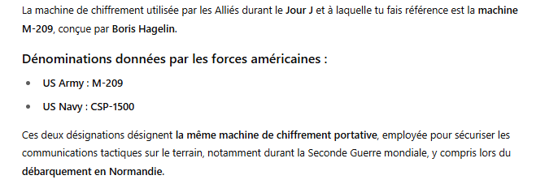

**🎯 Flag :** `M-209_CSP-1500`

---

### 10. Ops Armada

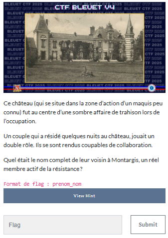

> En cherchant dans les barrages en 1943 pendant l'opération Armada je suis tombé sur ce [pdf](https://www.fondationresistance.org/documents/ee/Doc00006-011.pdf) qui nous donne la réponse.

**🎯 Flag :** `barrage_de_gigny`

---

### 11. Derriere les masques

> Avec une recherche inversée on trouve que la photo est liée à l'affaire du château de Solterre, et en regardant quelques liens on finit par tomber sur [celui-ci](https://maquisdelorris.fr/resistance/?page_id=3118).
> Un Ctrl+F "voisin" nous donne la réponse.

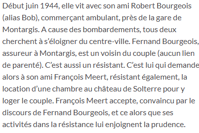

**🎯 Flag :** `fernand_bourgeois`

---

### 12. A la recherche du vaisseau perdu

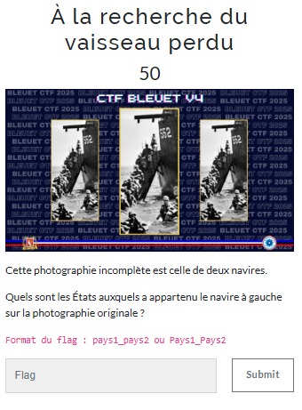

> Avec le reverse image on trouve l'image entière.

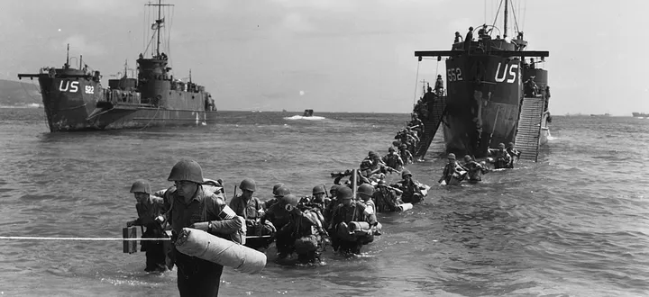

> On voit écrit US 522, avec une recherche on voit que le nom exact est USS LCI(L)-522 qu'on peut par exemple trouver [ici](https://uboat.net/allies/warships/ship/21586.html).
> Sur le même site, on trouve ce qu'on recherche.

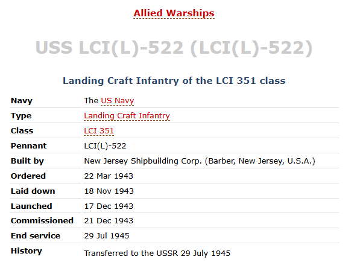

**🎯 Flag :** `usa_urss`

---

### 13. La derniere bataille de Jeanne

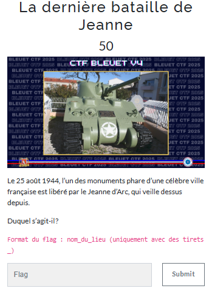

> Le reverse image nous donne tout de suite la [réponse](https://jipai.over-blog.com/2018/09/le-char.html)

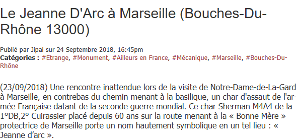

**🎯 Flag :** `notre_dame_de_la_garde`

---

### 14. Combattants du desert

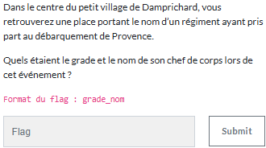

> pour connaitre le nom de la place petit coup de GPT, croisé avec Maps pour s'assurer de la véracité.

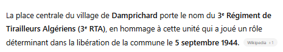

On tape ensuite le nom du régiment sur internet et [Wikipedia](https://fr.wikipedia.org/wiki/3e_r%C3%A9giment_de_tirailleurs_alg%C3%A9riens) nous donne la bonne réponse.

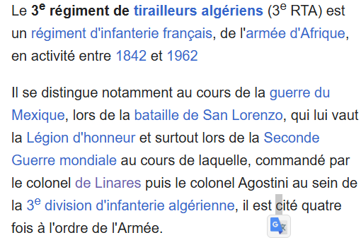

**🎯 Flag :** `colonel_de_Linarès`

---

### 15. Pas besoin de vous faire un dessin

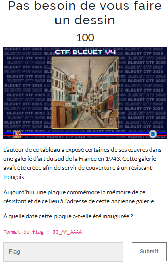

> Ce challenge s'est fait en 3 étapes, dans un premier temps un reverse sur l'image pour trouver que c'est "La Rue Saint-Dominique et la Tour Eiffel" de Maurice Utrillo.
> Ensuite un coup de ChatGPT avec les informations qu'on vient d'avoir pour se rendre compte qu'il est 22 rue de France à Nice.
> On cherche dans les alentours sur Maps et on trouve la bonne plaque.

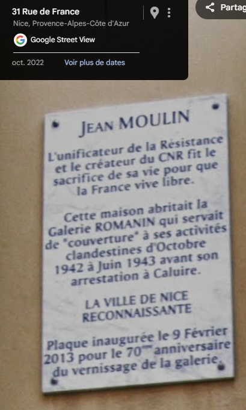

**🎯 Flag :** `09_02_2013`

---

### 16. Heure de partir

> A ce moment là petite saturation donc j'en profite pour flag celui de la fin, histoire de remettre un peu de baume au coeur !

**🎯 Flag :** `bleuet_de_france`

---

### 17. Aux origines du CTF 1

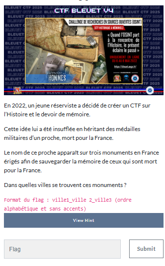

> Sur la page du [CTF](https://bleuet.aege.fr/) se trouve un article qui explique tout.

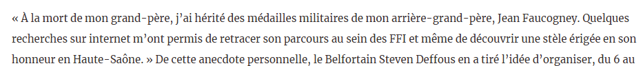

> En tapant son nom on trouve le site des [fusillés](https://fusilles-40-44.maitron.fr/faucogney-jean-albert-emile/) qui va aussi beaucoup nous servir pour la suite.

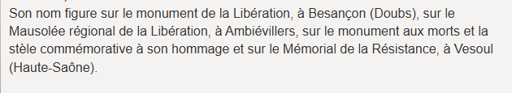

**🎯 Flag :** `ambievillers_besançon_vesoul`

---

### 18. Shadow of the soldier

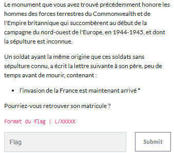

> En cherchant un soldat canadien, j'ai fini par tomber sur le site du musée canadien de la guerre, et plus particulièrement sur l'[article](https://www.museedelaguerre.ca/ressources-sur-le-jour-du-souvenir/lettre-datee-du-4-juin-1944) qui nous intéresse.

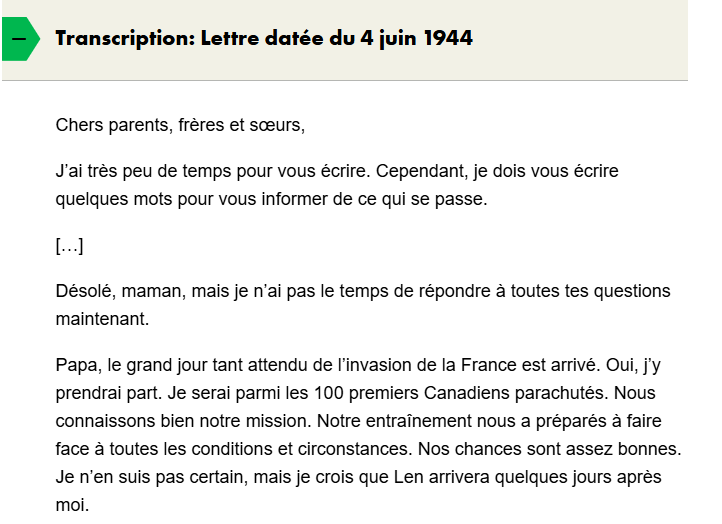

> On a donc le nom du soldat, Leslie Neufeld, en en tapant son nom on trouve le site des [veterans](https://www.veterans.gc.ca/fr/remembrance/memorials/canadian-virtual-war-memorial/detail/2628195).

**🎯 Flag :** `L/74243`

---

### 19. Parachutage en zone interdite

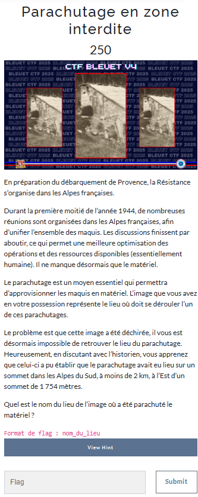

> En scrollant un petit moment (j'avais la foi... mais 250 le challenge je me doutais que ça serait pas facile) j'ai fini par retrouver la photo :

> Et sur le [site](https://champsaur.net/1944-la-resistance-sorganise-dans-les-alpes/) la réponse apparait tout de suite sous l'image.

**🎯 Flag :** `grand_morgon`

---

### 20. Soldat inconnu

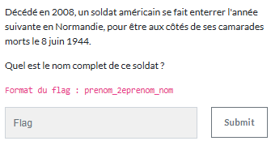

> Je ne sais plus, trop de temps a coulé (sorry).

**🎯 Flag :** `william_humphrey_tucker`

---

### 21. Une histoire cryptee

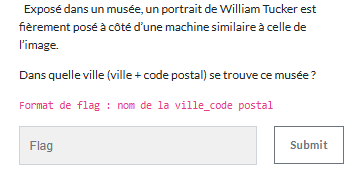

> GPT for life

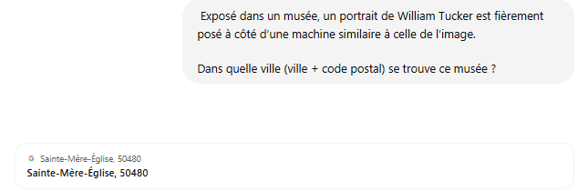

**🎯 Flag :** `sainte-mere-eglise_50480`

---

### 22. Sur les pas de la 2e DB

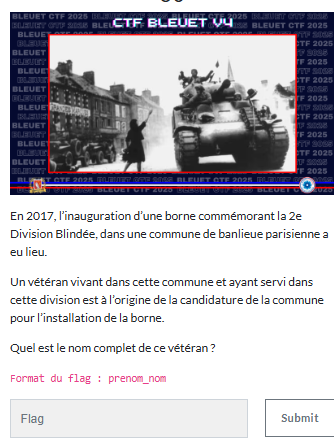

> Pareil que pour le soldat... je ne sais plus !

**🎯 Flag :** `serge_finot`

---

### 23. Campagne Allemagne

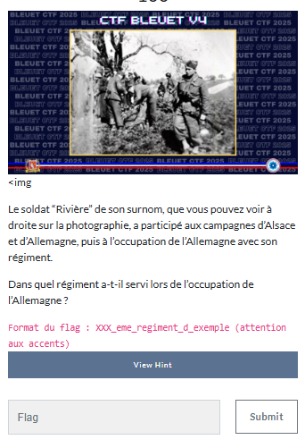

> Avec un reverse on tombe tout de suite sur [https://archives.valdemarne.fr/paroles-des-annees-noires/fiche-contextuelles/la-liberation-de-la-france](https://archives.valdemarne.fr/paroles-des-annees-noires/fiche-contextuelles/la-liberation-de-la-france?arko_default_62d93d434b7f2--ficheFocus=&arko_default_62d9118a0d1ad--ficheFocus=)
> On cherche ensuite le régiment de Marcel Godefroy et on a le résultat.

**🎯 Flag :** `126_eme_regiment_d_infanterie`

---

### 24. Grotte oubliee histoire retrouvee

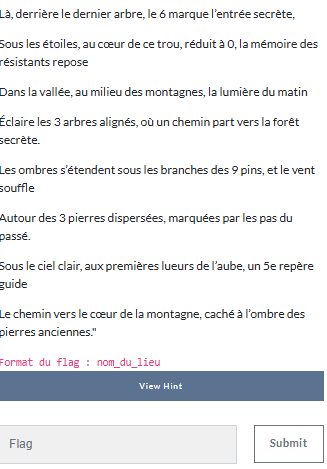

> Le texte est beaucoup plus long mais pas la place !
> A première vue... ça a l'air compliqué.
> Après avoir tenté de rechercher mot par mot tout ce qui était écrit dans le texte, sillonné la Provence de long en large, on finit par se rendre compte qu'il y a beaucoup de nombres dans le texte...
> En les rassemblant et en coupant la poire en deux, on obtient des coordonnées qui emmène précisement à la grotte des résistants

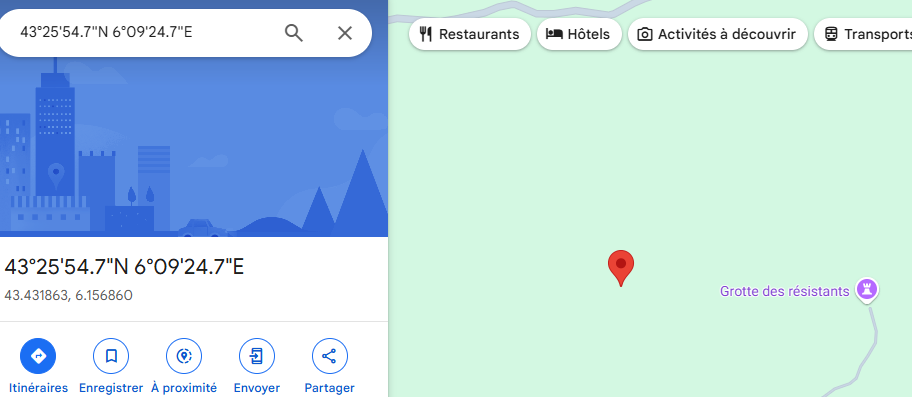

**🎯 Flag :** `grotte_des_resistants`

---

### 25. On y danse tous en rond

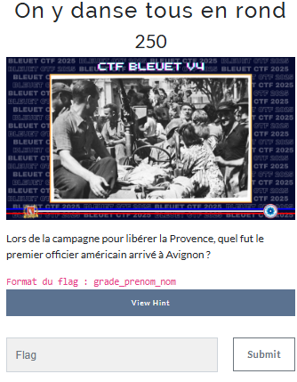

> Pour ce challenge il fallait connaitre le site [Gallica](https://gallica.bnf.fr/) qui recense énormement d'articles en tout genre.
> En jouant avec les recherches avancées du site on finit par trouver cette [article](https://www.retronews.fr/journal/la-gazette-provencale/26-aout-1944/1/044fa541-1047-4348-99a5-deb71ad1743b) :

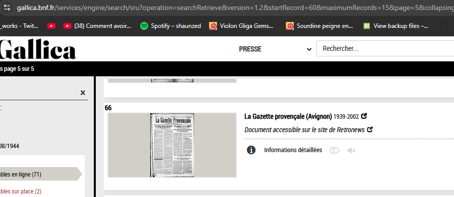

> Au milieu à gauche de l'article, la réponse.

**🎯 Flag :** `vincent_weygant`

---

### 26. Du sang et des larmes

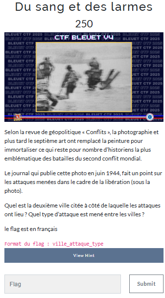

> En tapant la phrase de la question on tombe sur un article du [Conflits](https://www.revueconflits.com/galerie-des-batailles-armee-francaise-emmanuel-caillat/) qui nous mène lui même sur un article du [Monde](https://www.lemonde.fr/arts/article/2015/08/10/les-photos-du-debarquement-de-robert-capa-au-c-ur-d-une-polemique_4719583_1655012.html).
> Sur cet article on voit écrit "Robert Capa, ne mériteraient pas l’aura légendaire qui les entoure depuis leur publication dans le numéro de Life paru le 19 juin 1944."
> Avec [Google Books](https://books.google.fr/books?id=dk8EAAAAMBAJ&printsec=frontcover&hl=fr#v=onepage&q&f=false) on trouve l'article en bonne qualité, et la réponse par la même occasion.

**🎯 Flag :** `isigny_attaque_maritime`

---

### 27. M-209

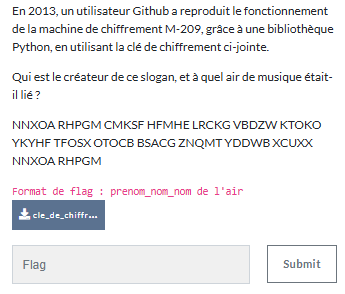

> On installe comme demandé ce qu'il faut à l'aide de [Github](https://github.com/gremmie/m209).
> On suit les consignes et on arrive sans soucis à déchiffrer.

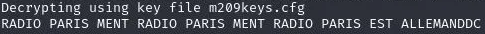

> En tapant ce qui est écrit sur Google on trouve plein de vidéos.

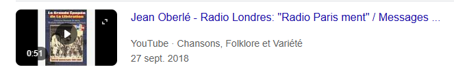

> On a donc le nom, et on reconnait l'air de la cucaracha.

**🎯 Flag :** `jean_oberle_la_cucaracha`

---

### 28. Aux origines du CTF 2

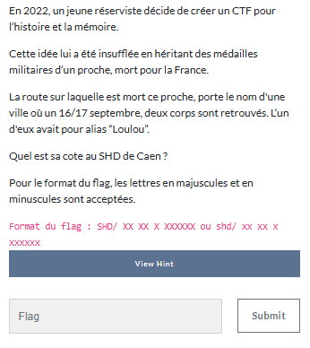

> Retour sur les [fusilles](https://fusilles-40-44.maitron.fr/faucogney-jean-albert-emile/) où on voit que Jean est mort à Conflans-sur-Lanterne.
> En tapant "Saint-Loup-sur-Semouse 16 septembre guerre" on tombe sur un [blog](http://saint-loup.chez-alice.fr/Saintloup/histsloup/1939.html) qui nous parle de REBOURCET Gaston et ROBERT Marcel.
> N'ayant pas trouvé d'alias loulou après de nombreuses recherches sur différents sites tels que [https://www.memoiredeshommes.sga.defense.gouv.fr/fr/](https://www.memoiredeshommes.sga.defense.gouv.fr/fr/) j'ai testé l'un puis l'autre.

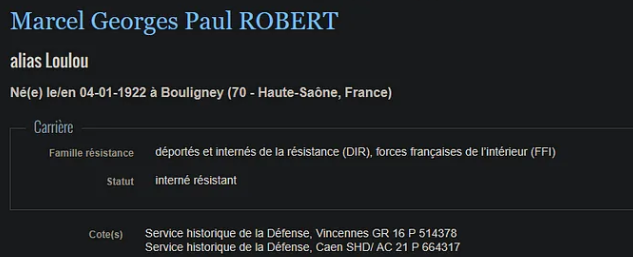

**🎯 Flag :** `SHD/AC 21 P 664317`

---

## Techniques utilisees

Voici un récapitulatif des techniques, outils, sites et pivots utilisés tout au long du CTF :

### 🧠 Recherche historique & croisement d'archives

- Recherche de noms, dates, lieux, unités militaires :
  - Base de données [Mémoire des hommes](https://www.memoiredeshommes.sga.defense.gouv.fr)
  - Dictionnaire des fusillés (Maitron)
  - Blogues et archives locales de résistants
- Identification de régiments et batailles via :
  - [Wikipedia](https://fr.wikipedia.org), [Archives départementales](https://archives.valdemarne.fr), sites de fondations mémorielles
- Consultation de bases spécialisées :
  - [Gallica](https://gallica.bnf.fr), [RetroNews](https://www.retronews.fr)

---

### 🌍 Géolocalisation & investigation par images

- Recherche inversée d’images (Google Images, Yandex)
  - Identification de lieux de mémoire, monuments, bâtiments historiques
- Croisement visuel + historique sur [Google Maps](https://maps.google.com), Street View
- Comparaison de photos avec photos d’époque (mémoriaux, plaques, lieux)
- Détection de coordonnées à partir d’indices dans le texte ou d’annotations GPS

---

### 🔍 Analyse documentaire & sémantique

- Lecture et analyse de textes historiques, extraits de journaux, plaques commémoratives
- Déchiffrement de contenus chiffrés simples :
  - Type Hagelin, M-209 (décrypteurs GitHub, ChatGPT)
- Analyse des documents fournis (lettres, notes, extraits PDF)
- Lecture de rapports et témoignages historiques

---

### 💬 Assistance IA & vérification croisée

- Utilisation raisonnée de ChatGPT pour :
  - Comprendre des systèmes de chiffrement historiques
  - Identifier des figures et événements méconnus
  - Obtenir des pistes à recouper
- Vérification systématique des informations sur :
  - Sites officiels, sources d’archives, bases militaires ou associatives

---

### 🎖️ OSINT contextuel et mémoriel

- Croisement d’éléments biographiques (résistants, soldats, figures locales)
- Déduction de dates ou lieux à partir d’un contexte historique (ex : opération Koufra, débarquement, libération)
- Recherche de citations, lois ou décorations (ex : L511-2)
- Fouille dans des publications officielles d’époque (Life Magazine, musées)

---

### 📜 Typologie des OSINT mobilisés

- **OSINT Humain** : identification de figures historiques (soldats, résistants)
- **OSINT Archives** : fouille de bases de données spécialisées
- **OSINT Lieu** : géolocalisation de lieux historiques à partir de photos
- **OSINT Documentaire** : analyse de presse ancienne, articles, photos
- **OSINT Cryptographique** : déchiffrement d’outils historiques (M-209, Hagelin)

---
<!-- Hashtags pour référencement -->
#OSINT #Cybersecurity #CTF #ThreatIntelligence #Investigation #Renseignement
