# Write-up – HACK'OSINT 2 - Grande Finale

_Type : CTF OSINT  
Date : Mai 2025  
Classement 🥈 : **Top 2/4**_

_Réalisé en équipe de 4 avec Yukss/Emerald/Nyxou sous le nom d'équipe **OsintSpecialSquad117**_

_Tous les flags ne sont pas dans le meilleur ordre possible, mais c'est l'ordre dans lequel on les a trouvé._

## 📌 Sommaire

- [CN Solve](#1-cn-solve)
- [Site vitrine](#2-site-vitrine)
- [TocTocToc](#3-toctoctoc)
- [Mon amie](#4-mon-amie)
- [H Solve](#5-h-solve)
- [En public](#6-en-public)
- [G Solve](#7-g-solve)
- [Il etait une fois](#8-il-etait-une-fois)
- [Politique d'envoi](#9-politique-d-envoi)
- [Une passion](#10-une-passion)
- [Tout est lie](#11-tout-est-lie)
- [F Solve](#12-f-solve)
- [Bienvenue](#13-bienvenue)
- [Drôle d'individu 3](#14-drole-d-individu-3)
- [Une adresse ? Où ca ?!](#15)
- [Entree gratuite](#16-entree-gratuite)
- [Drôle d'individu 2](#17)
- [Au soleil](#18-au-soleil)
- [Drôle d'individu 1](#19)
- [Monsieur X](#20-monsieur-x)
- [Drôle d'individu 4](#21)
- [El creator](#22-el-creator)
  
### 1. CN Solve

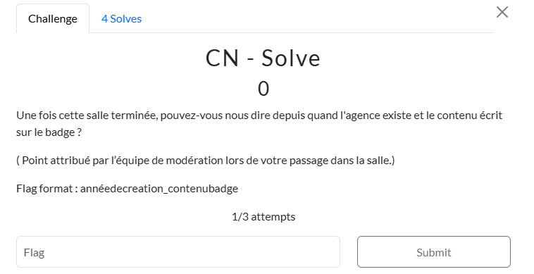

> Dans la salle de Charlotte Nectoux de nombreux élément étaient reliés entre eux par des fils (éléments qui nous serviront par la suite)
> En parlant avec le directeur de Charlotte (RP) présent dans la salle on finit par savoir que la société s'appelle Mysterio et qu'elle a été crée en 2025.
> En le distrayant on arrive à récupérer le badge initialement dans sa poche et à sortir de la salle.
> Avec un lecteur RFID, son badge nous indique "ID RS AGENCE : 7481703571864978455"

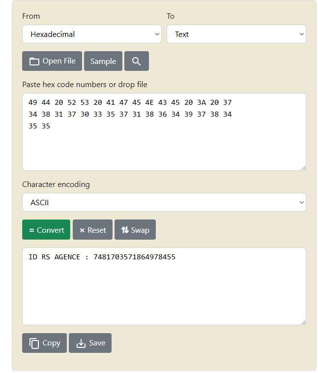

**🎯 Flag :** `2025_7481703571864978455`

---

### 2. Site vitrine

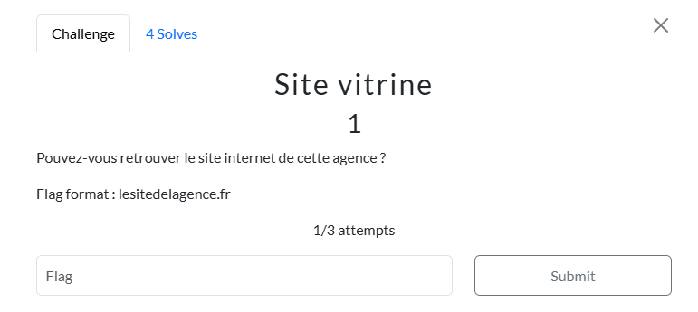

> Avec la phrase récupérer grâce au badge on en déduit qu'un des réseaux sociaux (ID RS) va nous aider à avancer.
> En rentrant ces numéros sur tiktok (/@7481703571864978455) on tombe sur [leur entreprise](https://www.tiktok.com/@mystoriagency).

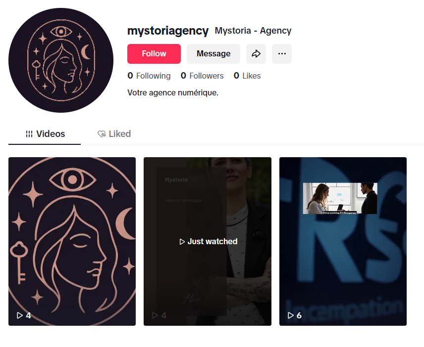

> En connaissant maintenant le nom de l'entreprise complet on tombe rapidement sur leur [site](https://mystoriagency.pro/).

**🎯 Flag :** `mystoriagency.pro`

---

### 3. TocTocToc

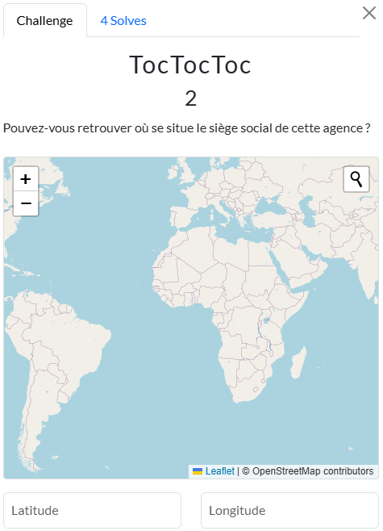

> Le nom du challenge a réveillé des traumatismes encore récent, mais il fallait continuer...

**🎯 Flag :** `ENTRER VILLE`

---

### 4. Mon amie

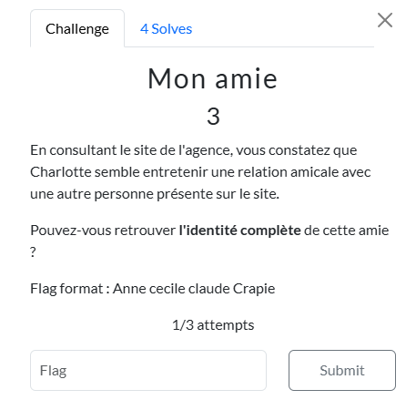

> Sur le site on voit qu'on peut cliquer sur différents profils et que le nom est dans l'url.

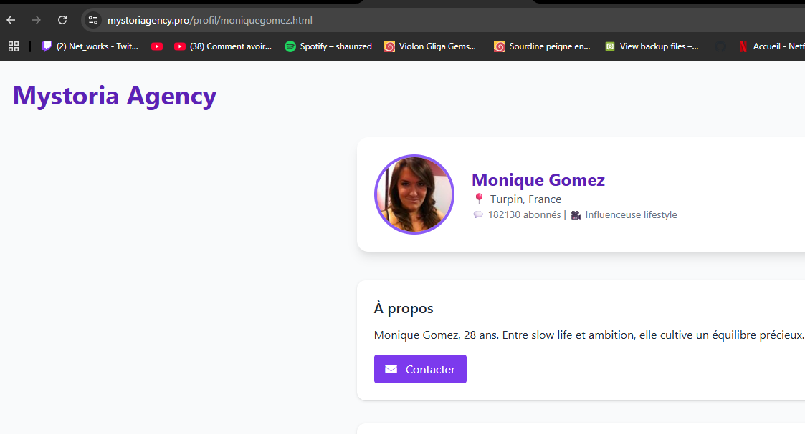

> Sur cette base-là on écrit charlottenectoux, on tombe bien sur son profil et sur ses relations, dont une seule lui écrit des commentaires, Anne Franck.

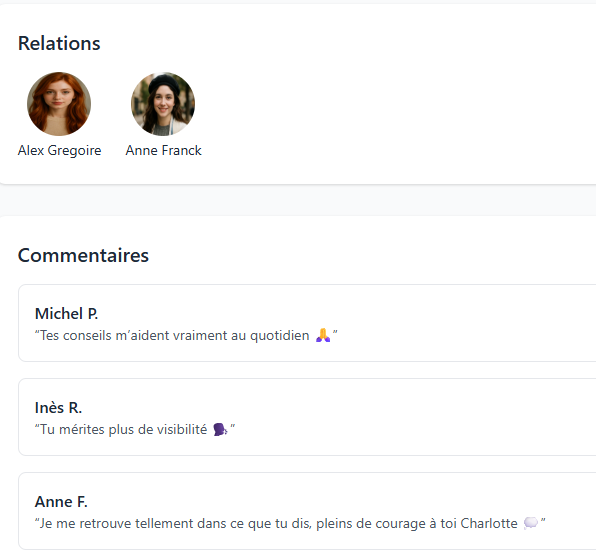

> En cliquant sur "Contacter" on récupère son adresse mail : annefranck74000@mystoria.fr et en cherchant son pseudo sur différents réseaux on finit par tomber sur son Pinterest.

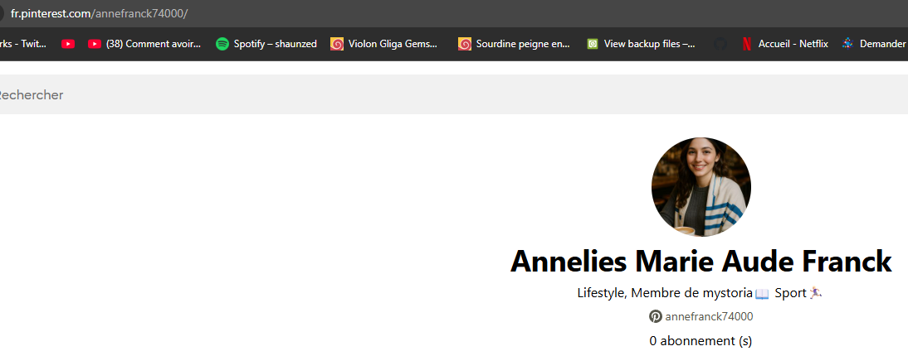

**🎯 Flag :** `Annelies Marie Aude Franck`

---

### 5. H Solve

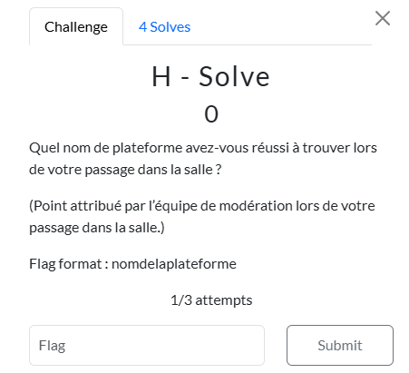

> Nouvelle salle en physique, on récupère les informations dans la pièce et au tableau dans un premier temps, ainsi qu'une paire de jumelles.
> En regardant à travers la fenêtre on observe dehors un homme de dos en train de téléphoner, avec sur son t-shirt un site internet : Adopte un phishing.

**🎯 Flag :** `adopteunphishing`

---

### 6. En public

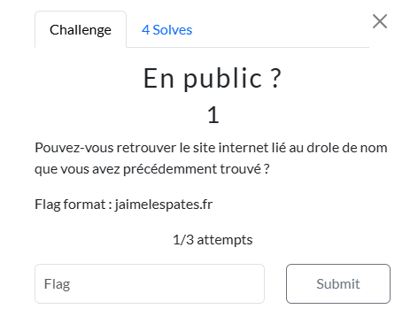

> En ayant le nom du site on cherche dans les .x les plus connus, et .eu nous donne la réponse.

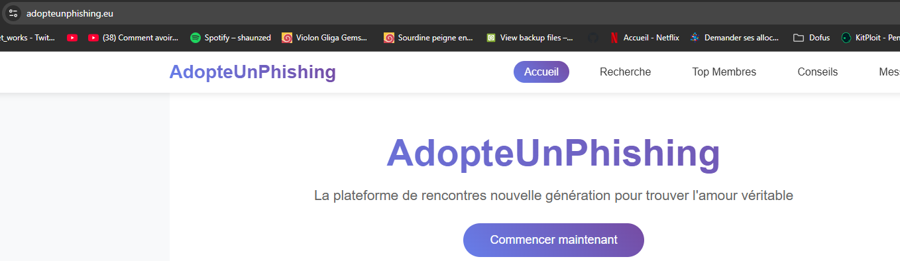

**🎯 Flag :** `adopteunphishing.eu`

---

### 7. G Solve

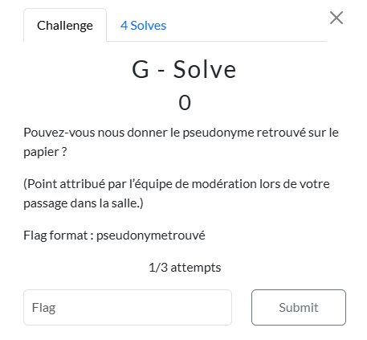

> Encore une salle en physique, et cette fois des plus musclées !
> En cherchant et en notant là-encore tout ce qu'on voit, je finis par trouver un bout de papier caché derrière la télé.
> Avant même d'avoir eu le temps de lire la note, je me fais attraper par deux personnes capuchées dans une autre salle et me retrouve à passer un interrogatoire.
> Sans le savoir les autres faisaient la même chose de l'autre coté, et nous étions jugés sur la cohérence de nos histoires.

**🎯 Flag :** `LotusBlood`

---

### 8. Il etait une fois

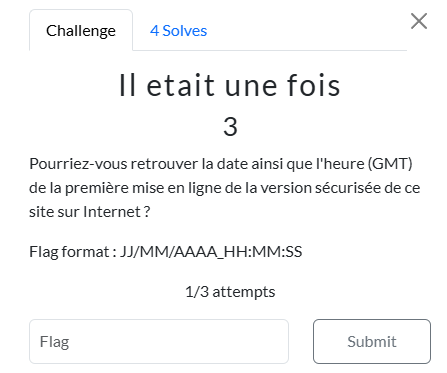

**🎯 Flag :** `Notre token`

---

### 9. Politique d'envoi

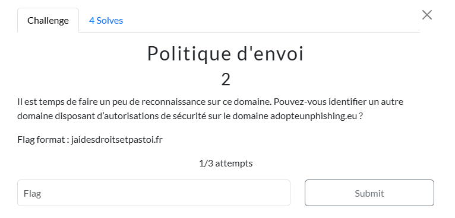

**🎯 Flag :** `Notre token`

---

### 10. Une passion

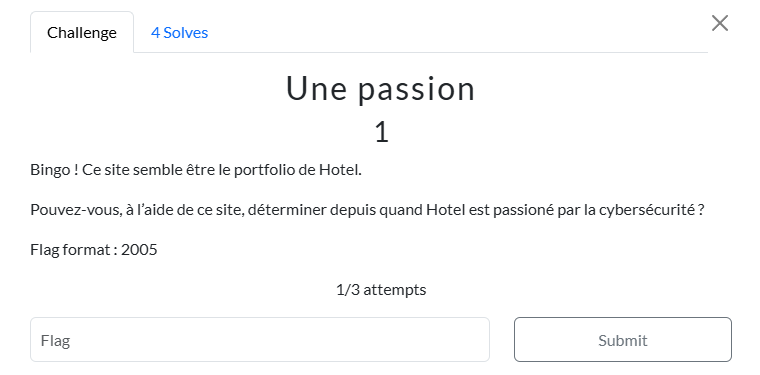

> Une fois sur son [site](https://hotellement.lat/) en regardant dans les souvenir on peut voir un évènement "BH - USA" parlant du quasi prime et du TIME IA.
> " Depuis ce jour, ma passion pour la cybersécurité n'a pas cessé de s'accroître"
> Avec un reverse image et en cherchant ces deux mots on tombe rapidement sur le Black Hat 2019.

**🎯 Flag :** `2019`

---

### 11. Tout est lié

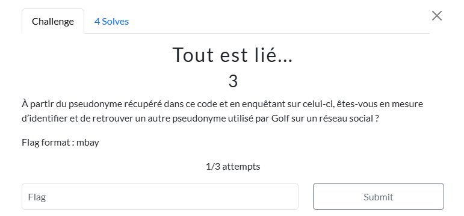

> De retour sur Golf, en sachant que son pseudo est LotusBlood et avec l'intervention musclée qu'il y a eu plus tôt on trouve un [Docker](https://hub.docker.com/u/lotusblood ).
> En regardant dans le code on finit par trouver une ligne "admin=" et quelque chose qui ressemble à un pseudo à l'envers.

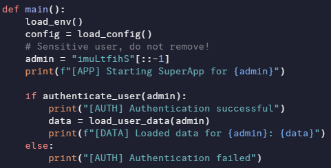

> On cherche si ce pseudo peut correspondre au sien et on tombe sur son compte [Mastodon](https://mastodon.social/@ShiftLumi).

**🎯 Flag :** `ShiftLumi`

---

### 12. F Solve

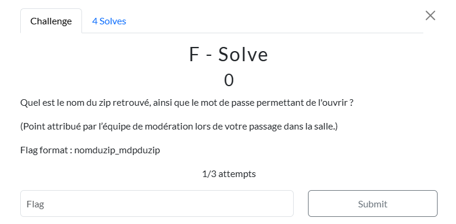

> Nous y étions déjà allé le matin mais il nous manquait les informations principales.
> Cette fois-ci en retournant le PC écrit en tout petit en dessous on peut voir le mot de passe qui ouvre la session de Foxtrot.
> En cherchant dans la session on trouve un fichier "Passwd" qui contient le mot de passe.

**🎯 Flag :** `nomduzip_epZQF*Mvgecy7!#6wR`

---

### 13. Bienvenue

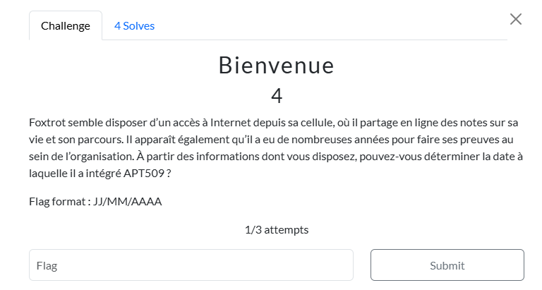

**🎯 Flag :** `Notre token`

---

### 14. Drôle d'individu 3

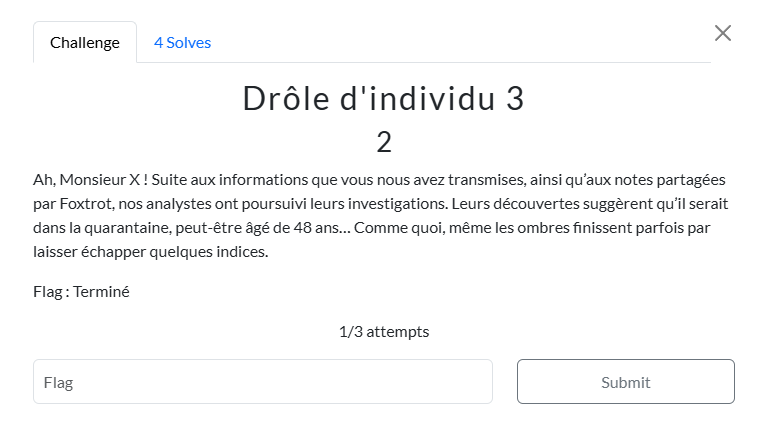

> On retient qu'il est âgé de 48 ans ou au moins dans la quarantaine, ça servira peut-être plus tard...

**🎯 Flag :** `Terminé`

---

### 15. Une adresse ? Où ca ?!

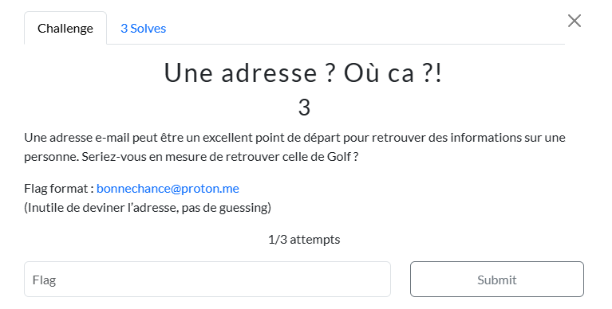

> Dans un premier temps on a trouvé le [Github](https://github.com/g0lf7-et) de Golf.
> En cherchant dans les repo' et plus particulièrement dans le Radar-Sniff une manipulation consiste à rajouter ".patch" sur un commit.
> En essayant sur plusieurs commit, on tombe sur son autre adresse mail.

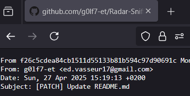

**🎯 Flag :** `ed.vasseur17@gmail.com`

---

### 16. Entree gratuite

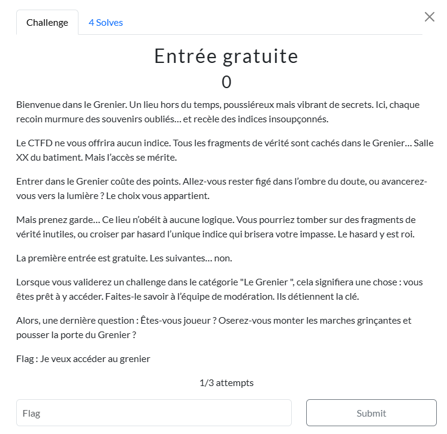

> Dans la journée on avait le droit d'aller dans le grenier, une salle dans le noir éclairé à la lampe torche et a la lampe UV.
> La première entrée était gratuite et les suivantes payantes de plus en plus cher.
> Dedans on tombe sur des images, des logos, le docker (déjà utilisé), de nombreuses choses dont 95% que nous avions déjà finit.
> Les deux seules choses qui sortaient du lot pour nous était une tinyurl et une double image avec le logo de Mammut et de URLScan.
> En ressortant on s'empresse de tester le tinyurl (qu'il fallait retenir de tête interdiction aux notes) et... Rick rolled...

**🎯 Flag :** `Je veux accéder au grenier`

---

### 17. Drôle d'individu 2

> Dans la salle de Charlotte Nectoux (CN Solve) il y avait un logo Strava.
> On cherche donc de la même manière Anne Franck sur cette application et on finit par [la trouver](https://www.strava.com/athletes/170478571).

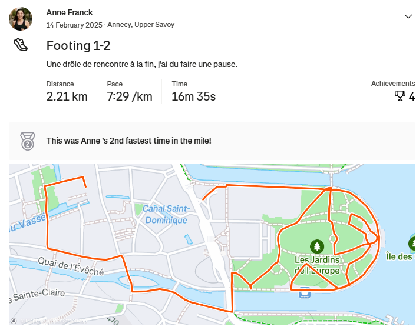

**🎯 Flag :** `L'emplacement de la fin de sa course Strava`

---

### 18. Au soleil

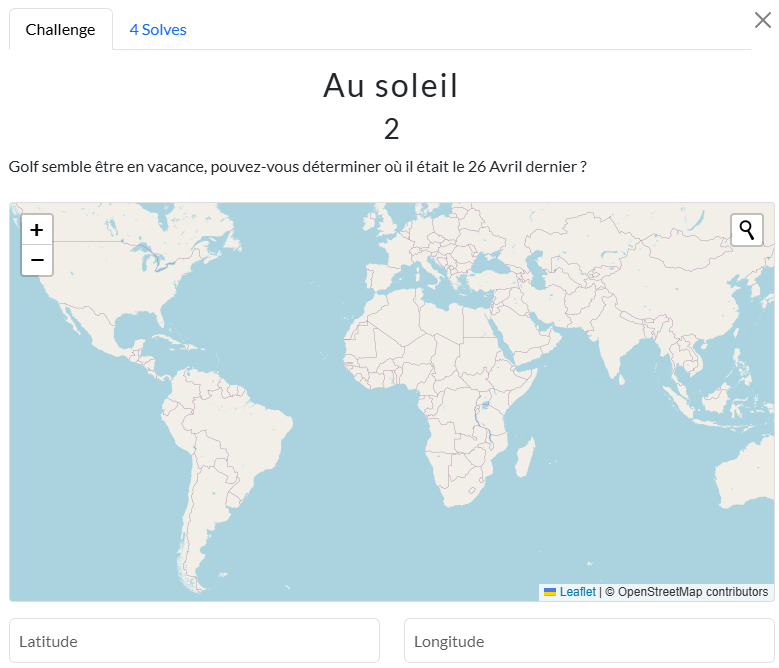

> Avec le nouveau compte [Mastodon](https://mastodon.social/@ShiftLumi) de Golf, on a plein de nouvelles informations, dont son emplacement du 26 Avril.

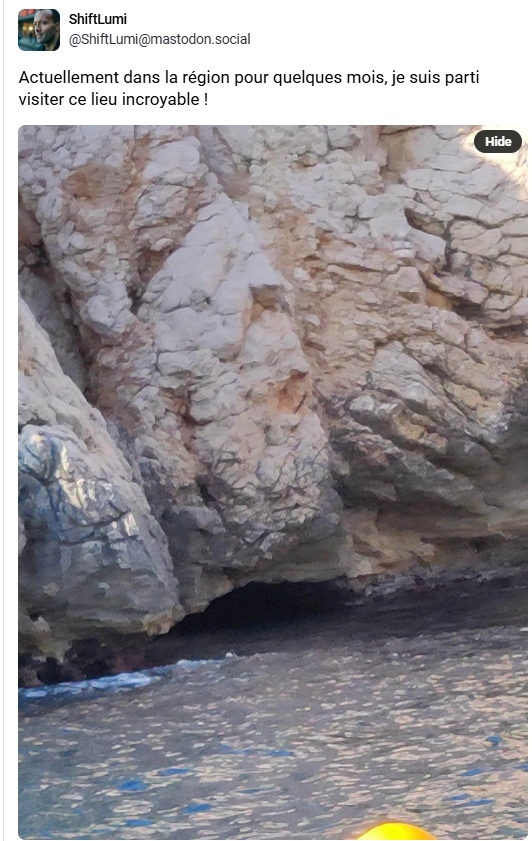

> Ca ressemble fortement aux calanques de Marseille, ce qui nous est confirmé rapidement avec un reverse image.

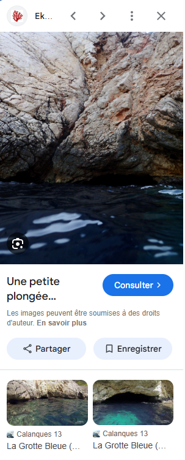

**🎯 Flag :** `Entrée de la grotte bleue`

---

### 19. Drôle d'individu 1

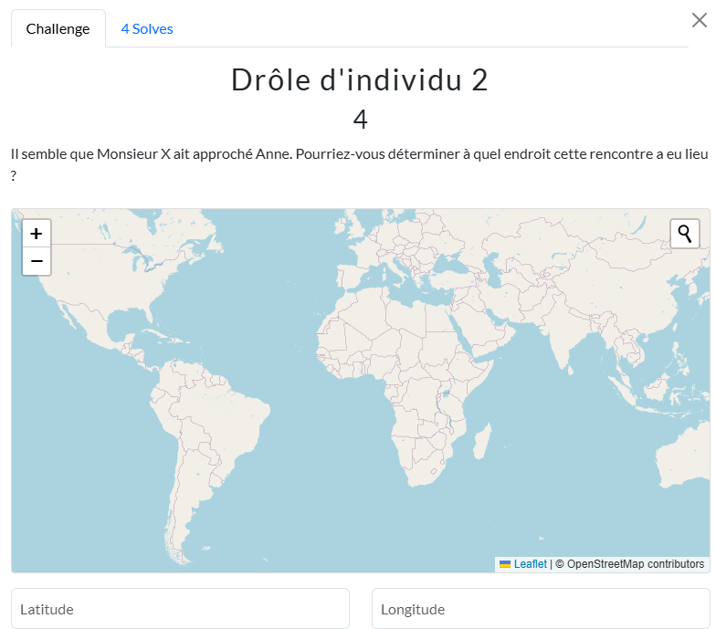

> Sur le lien on peut voir qu'un bot a été développer pour parler avec un brigadier.

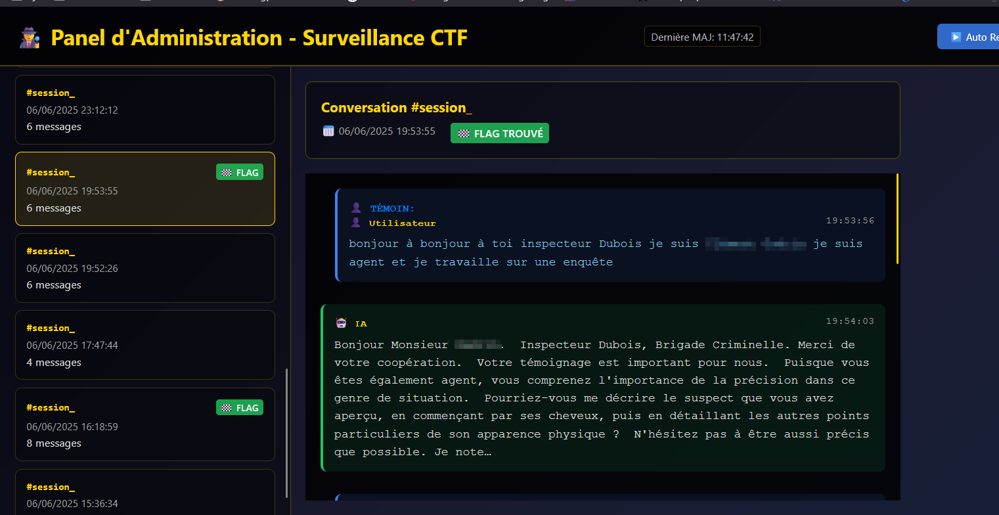

> A force de le cuisiner et de répondre à ses questions comme il souhaitait il finit par nous donner des informations sur Monsieur X après l'avoir traqué près de la grotte bleue.

**🎯 Flag :** `3`

---

### 20. Monsieur X

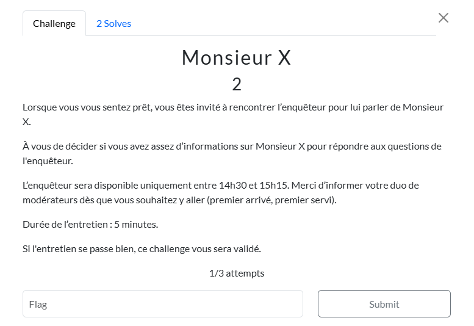

> C'est l'heure d'aller voir l'enquêteur !
> Arrivé sur place on tombe sur un homme qui nous pose des questions sur monsieur X, son âge, son emplacement, ce qu'il aime faire...
> On lui ressort tout ce qu'on a appris lors de l'enquête et à la fin il nous demande même un portrait robot.
> Je vous laisse admirer. (L'objectif final était d'avoir au moins 3 bonnes réponses.)

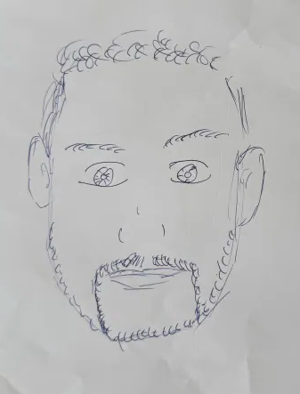

**🎯 Flag :** `Validation de l'enquêteur`

---

### 21. Drôle d'individu 4

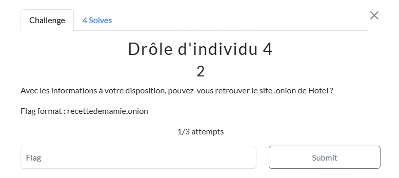

**🎯 Flag :** `Notre token`

---

### 22. El creator

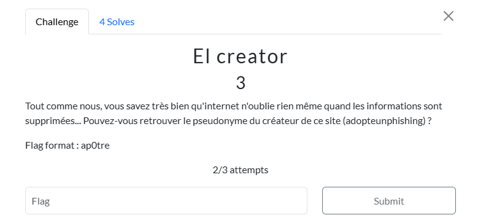

> Le seul challenge que nous n'avons pas fini à temps, après avoir cherché sur de nombreux outils, et même sur le bon... Celui qui nous aurait permis de finir premier !
> En mettant adopteunphishing.eu sur [URLScan](https://urlscan.io/result/019759c7-de96-73fa-a643-e9c3274534f2/loading) (que nous avions aussi vu dans le grenier aie aie aie...) on peut voir qu'un scan a été fait sur une url du site :

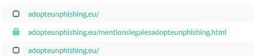

> Et en cliquant dessus et en regardant le screen... la réponse.

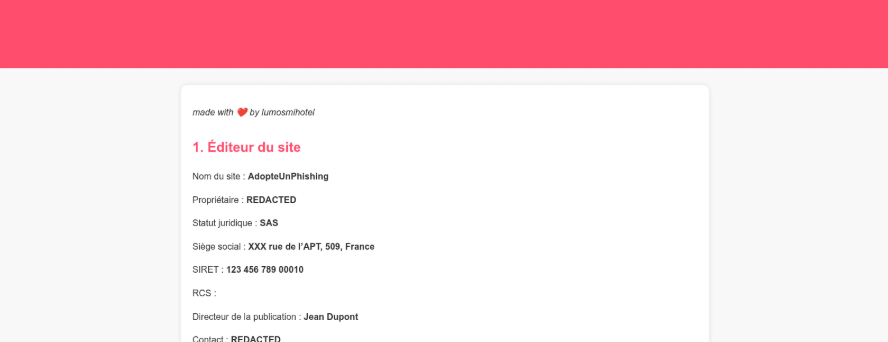

**🎯 Flag :** `lumosmihotel`

---
<!-- Hashtags pour référencement -->
#OSINT #Cybersecurity #CTF #ThreatIntelligence #Investigation #Renseignement
