# Write-up – HACK'OSINT 2

_Type : CTF OSINT  
Date : Mai 2025  
Classement 🥇 : **Top 3/378** (qualifiés pour la finale)_

_Réalisé en équipe de 4 avec Yukss/Emerald/Nyxou sous le nom d'équipe **OsintSpecialSquad117**_

_Tous les flags ne sont pas dans le meilleur ordre possible, mais c'est l'ordre dans lequel on les a trouvé._

## 📌 Sommaire

- [Declare ton equipe](#1-declare-ton-equipe)
- [Remember](#2-remember)
- [Interview](#3-interview)
- [Qui es-tu](#4-qui-es-tu)
- [Pseudonyme](#5-pseudonyme)
- [Premiere approche](#6-premiere-approche)
- [Vacances entre amis](#7-vacances-entre-amis)
- [Identite](#8-identite)
- [Un chanceux](#9-un-chanceux)
- [Double identite](#10-double-identite)
- [Ou es-tu](#11-ou-es-tu)
- [Revele ton secret](#12-revele-ton-secret)
- [Combien d'Hivers ?](#13-combiendhiver)
- [Les amoureuses](#14-les-amoureuses)
- [Joyeux anniversaire](#15-joyeux-anniversaire)
- [HOTEL CALIFORNIA](#16-hotel-california)
- [CCTV](#17-cctv)
- [L'element cle](#18-lelementcle)
- [Communication](#19-communication)
- [Le cote obscur](#20-le-cote-obscur)
- [Pardon vous etes](#21-pardon-vous-etes)
- [Pseudonyme 2](#22-pseudonyme-2)
- [Home Sweet Home](#23-home-sweet-home)
- [Envole-toi](#24-envole-toi)
- [Objectif EAGLE](#25-objectif-eagle)
- [Nouvelle cible 2](#26-nouvelle-cible-2)
- [Petit bateau](#27-petit-bateau)
- [Site vitrine 1](#28-site-vitrine-1)
- [L'allie](#29-lallie)
- [Jour J](#30-jour-j)
- [Mine d'or](#31-mine-dor)
- [L'oublié(e)](#32-l-oubliee)
- [Une drole d'entreprise](#33-unedroledentreprise)
- [Site vitrine 2](#34-site-vitrine-2)
- [Discretion assuree](#35-discretion-assuree)
- [TocTocToc](#36-toctoctoc)
- [Challenge Indefini](#37-challenge-indefini)
- [Techniques utilisees](#techniques-utilisees)
  
### 1. Declare ton equipe

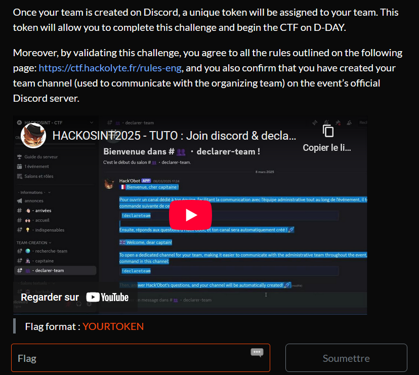

**🎯 Flag :** `Notre token`

---

### 2. Remember

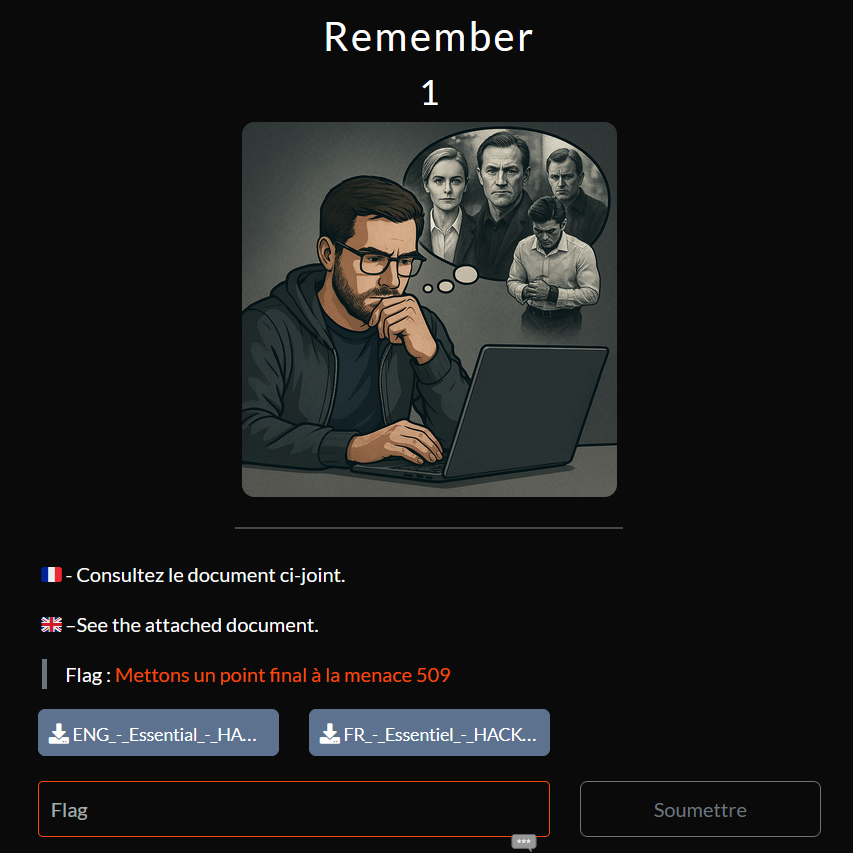

**🎯 Flag :** `Mettons un point final à la menace 509`

---

### 3. Interview

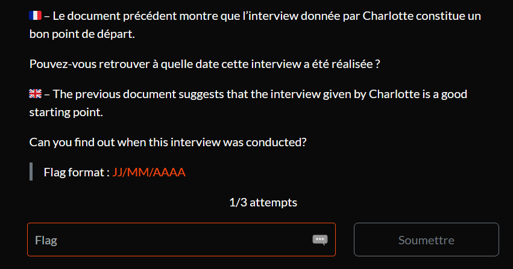

> En regardant le PDF donné on trouve le [compte X](https://x.com/CN_CumSpe) et le [medium](https://medium.com/@charlotte.nectoux/about) de Charlotte Nectoux.
> On voit aussi qu'elle a fait [une interview](https://medium.com/@marcsteinerdailynews/cybers%C3%A9curit%C3%A9-le-pi%C3%A8ge-du-phishing-et-la-chute-du-groupe-509-60db7eab364e) avec Marc Steiner et sur son compte X, la date.

**🎯 Flag :** `02/02/2025`

---

### 4. Qui es-tu 

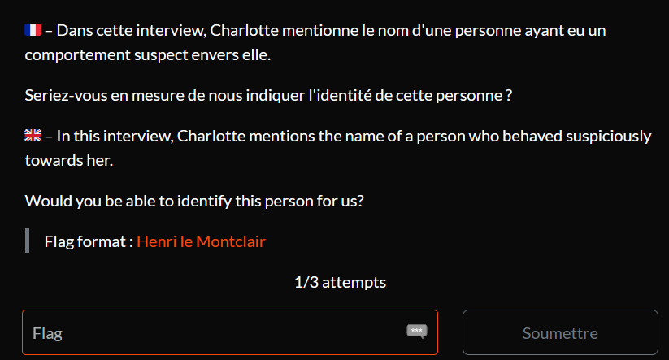

> On lit juste l'interview et on voit la réponse.

**🎯 Flag :** `Nicolas de Richelieu`

---

### 5. Pseudonyme

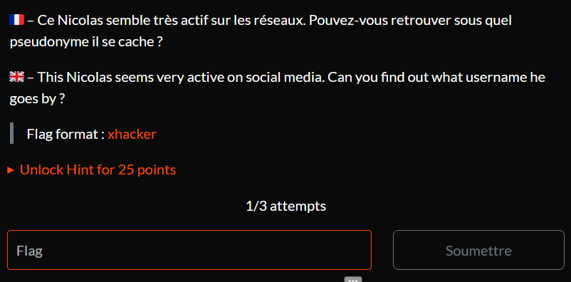

> En cherchant dans les réseaux de Nicolas, on finit par trouver son [Facebook](https://www.facebook.com/profile.php?id=61576075067801&sk=friends).
> Une photo de sa chambre y est présente dans ses stories, et dedans, un tshirt avec écrit "Xnicolasht".

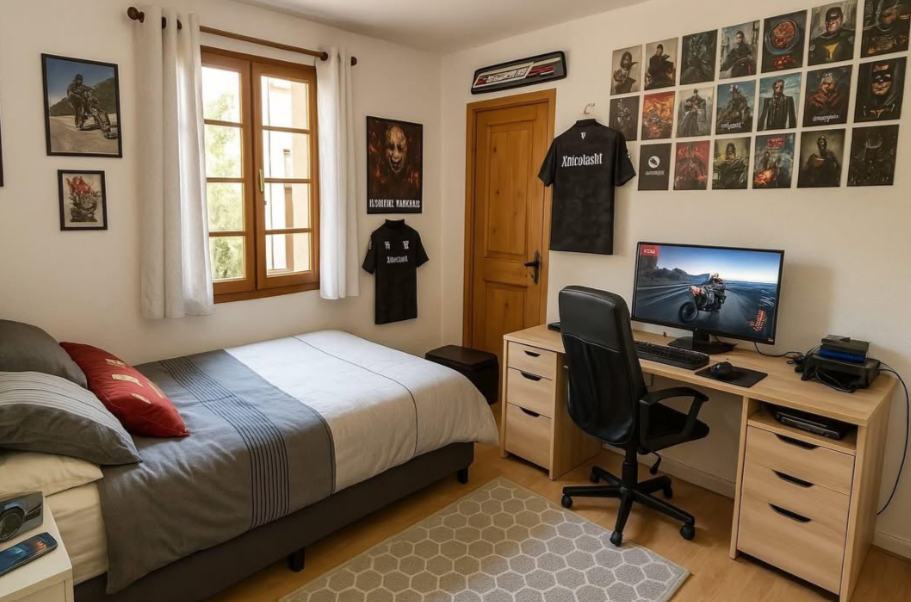

**🎯 Flag :** `Xnicolasht`

---

### 6. Premiere approche

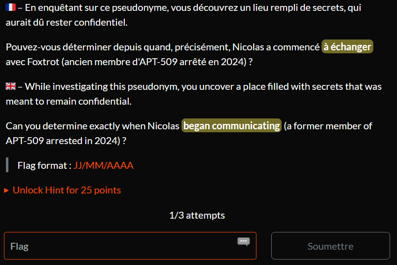

> En cherchant le [Bluesky](https://web-cdn.bsky.app/profile/xnicolasht.bsky.social/) de Nicolas, on voit qu'il a posté un photo.
> Dessus une url où on ne voit pas le domaine, mais on reconnait le site de [cryptpad](https://cryptpad.fr/drive/#/2/drive/view/f3YGBpPsdLVDxwpvH+PfWsHBS2nNHpOgLwGr-VP9cHI/) .

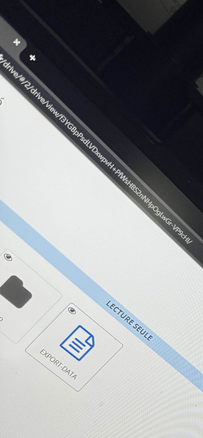

> En regardant dans les messages dans /509/F-memory-2023-2024, on voit qu'il a commencé à parler a Foxtrot, de son vrai nom Hugo Lecomte, le 7 septembre 2023.

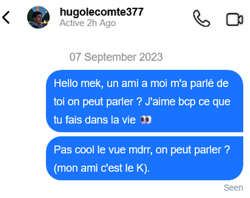

**🎯 Flag :** `07/09/2023`

---

### 7. Vacances entre amis

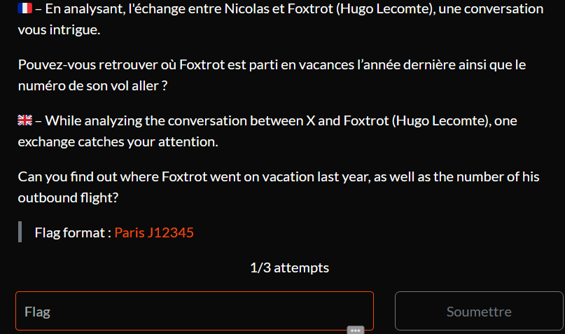

> Toujours dans les photos du cryptpad, Foxtrot explique être parti avec #H en vacances.
> Il montre une photo d'un restaurant, qu'on peut retrouver avec un peu de GEOINT, le Dar Chef, à Marrakech

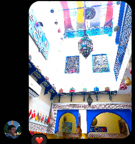

> En regardant sur le site https://www.flightera.net/, on trouve le bon vol

**🎯 Flag :** `Marrakech U24663`

---

### 8. Identite

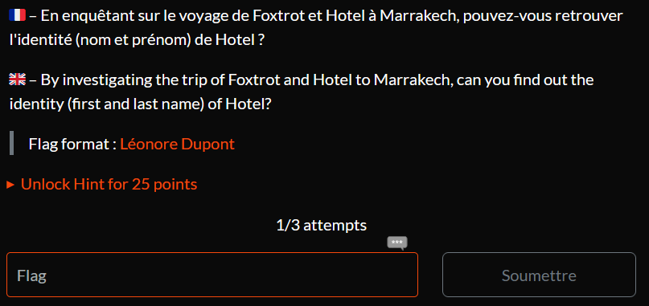

> En regardant les avis récents sur [TripAdvisor](https://www.tripadvisor.fr/Profile/78478HBethune) à Marrackech, on voit un certain Henry B, et dans son username HBethune.

**🎯 Flag :** `Henry Bethune`

---

### 9. Un chanceux

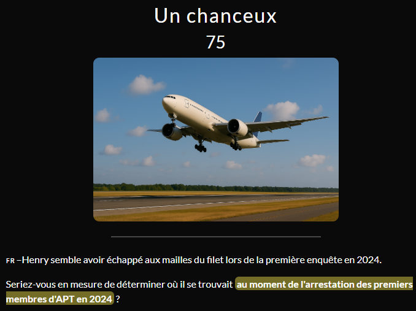

> En regardant les dates d'arrestation on a vu qu'elles se situaient le 23 juin.
> Challenge qui nous a couté plus de la moitié de nos fails (2), en se basant sur ces commentaires Tripadvisor qui concordaient au niveau des dates en emmenant vers le marché d'APT.
> En regardant par la suite son [carnet de voyage](https://www.myatlas.com/HenryBethune?t=user&q=Henrybethune) on a vu qu'il se trouvait au Japon, et avec les photo on voit que c'est au "Chanko & Wanko Restaurant" (avec le décalage horaire).

**🎯 Flag :** 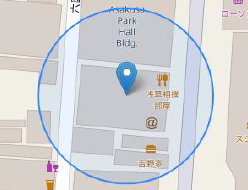

---

### 10. Double identite

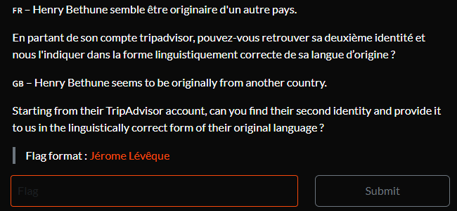

> Toujours sur son carnet de voyage on peut voir qu'il a publié une photo au Japon, sur un carnet intitulé "Retour au pays natal", ce qui concorde avec un message vu dans le cryptpad où on voit un drapeau japonais.
> En traduisant le nom de la photo on tombe sur Ren Sato.

**🎯 Flag :** `Ren Sato`

---

### 11. Ou es tu

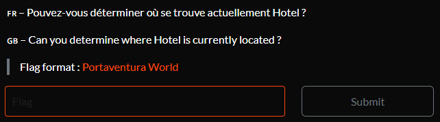

> Toujours sur le [MyAtlas](https://www.myatlas.com/HenryBethune?t=user&q=Henrybethune) on voit qu'Hotel possède un compte Snapchat :

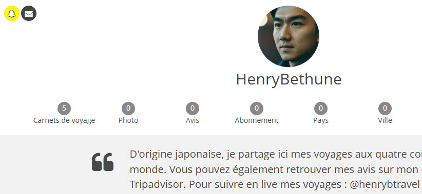

> En regardant ses stories on aperçoit une photo à Disneyland Paris.

**🎯 Flag :** `Disneyland Paris`

---

### 12. Revele ton secret

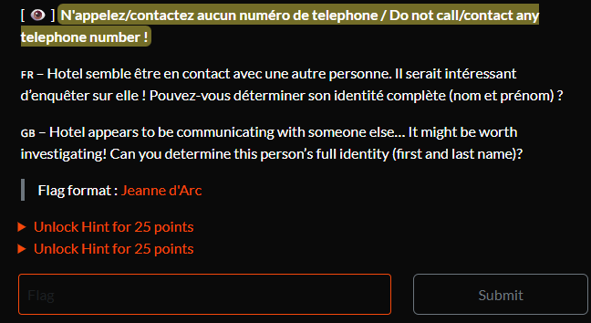

> Dans une autre story Snapchat on le voit parler avec "lg-account".
> En regardant les photos publiées par cette personne on voit un numéro de téléphone sur le collier d'un chien qu'on rattache à un WhatsApp.

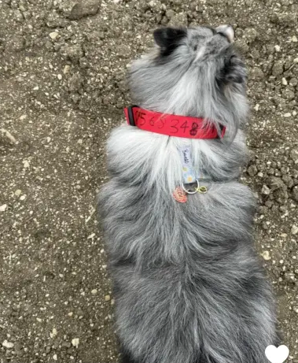

> En bas sur la photo de profil WhatsApp on peut voir écrit "by [eliasphotography.blog](https://eliasphotography.blog/)"
> On s'inscrit à sa newsletter qui nous dit comment rentrer en contact avec lui, et en lui parlant et à l'aide des exfis des photos il finit par nous donner son nom.

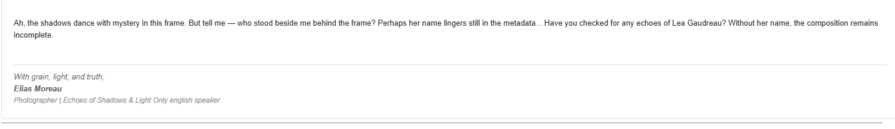

**🎯 Flag :** `Léa Gaudreau`

---

### 13. Combien d'Hivers ?

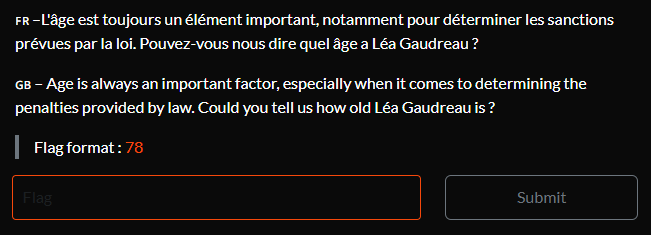

> En ayant son nom avec une recherche rapide on trouve son compte [Instagram](https://www.instagram.com/lgaudreau_/)
> Dans sa bio, on peut voir son age

**🎯 Flag :** `27`

---

### 14. Les amoureuses

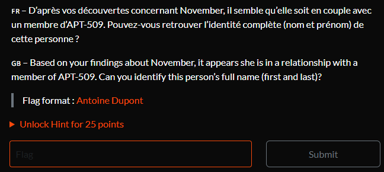

> Sur sa bio [Instagram](https://www.instagram.com/lgaudreau_/) on voit écrit "#L <3" et pareil dans une de ses stories.
> Sa photo a été prise par "Lise".
> On trouve aussi le [Google Calendar](https://calendar.google.com/calendar/u/0/embed?src=lea.gaudreau.pro@gmail.com) de Léa avec Epieos qui nous confirme des soupçons en fouillant dans les dates.
> En regardant son compte [Theads](https://www.threads.com/@lgaudreau_?xmt=AQF0UhQeU8aIylmLc6bSg25HAnaWmpZFWoG7qlX2lr_Drhw) on voit qu'elle se plaint que notre mystérieuse personne joue trop aux echecs avec une "JLMaigot" 
> Avec une recherche sur [Instant Username](https://instantusername.com/?q=JLMaigot) on trouve qu'elle à un compte [Chess.com](https://www.chess.com/member/JLMaigot) et qu'elle joue beaucoup avec une certaine "ChessM8_Saunier" (les refs KC/JL/M8.. du CTF sont marrantes).

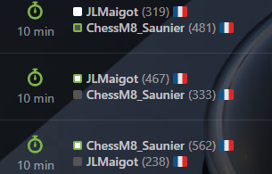

> En regardant le compte de [ChessM8_Saunier](https://www.chess.com/member/chessm8_saunier) on trouve un [linktree](https://linktr.ee/m8_lsaunier).
> On a donc maintenant son nom et son prénom

**🎯 Flag :** `Lise Saunier`

---

### 15. Joyeux anniversaire

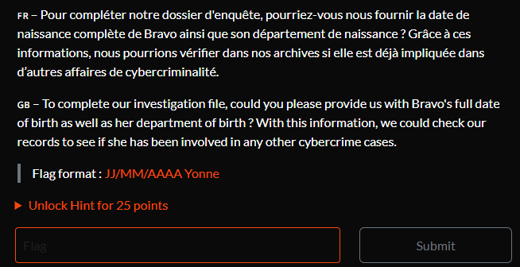

> Avec le [linktree](https://linktr.ee/m8_lsaunier) on tombe sur son site [https://mymemoriegram.xyz/](https://mymemoriegram.xyz/).
> Une photo d'elle est postée où elle deux QRCode et un code barre de tatoué.
> En déchiffrant le tout (et en esquivant les QRCodes qui emmenent vers RickRoll...) on tombe sur sa carte vitale (validé par le [Google Calendar](https://calendar.google.com/calendar/u/0/embed?src=lea.gaudreau.pro@gmail.com) qui correspond au niveau de la date de naissance)
> Toutes les infos sont dans la carte il suffit de savoir la lire.

**🎯 Flag :** `14/08/1993 Vaucluse`

---

### 16. HOTEL CALIFORNIA

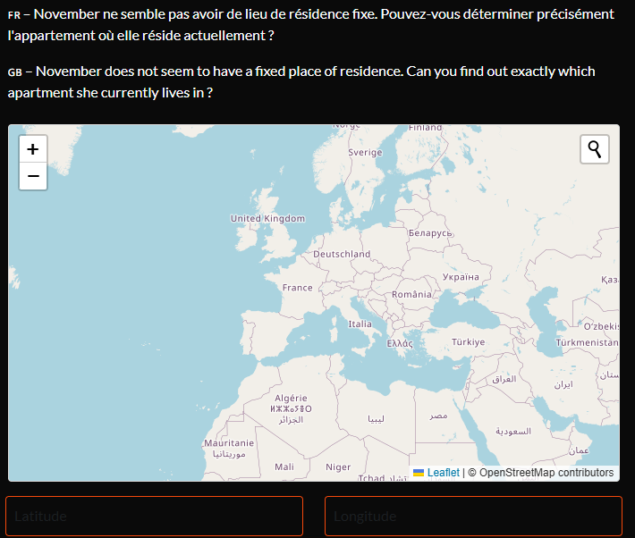

> Sur le [Theads](https://www.threads.com/@lgaudreau_?xmt=AQF0UhQeU8aIylmLc6bSg25HAnaWmpZFWoG7qlX2lr_Drhw) de November on peut voir qu'elle a séjourné dans un Airbnb avec "vue sur la dame de fer" (donc à Paris).
> Dans un autre poste on voit qu'elle vend des vêtements et avec quelques recherches on arrive à son compte [Vinted](https://www.vinted.fr/member/266597511).
> Dedans une photo d'une image d'elle avec vue sur la Tour Eiffel, on croise les infos avec "Nicolas", Airbnb, Tour Eiffel et la photo qu'on a et on tombe sur le bon [Airbnb](https://www.airbnb.fr/rooms/53885435).
> Avec StreetView on trouve les coordonnées exactes.

**🎯 Flag :** 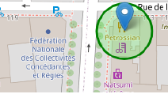

---

### 17. CCTV

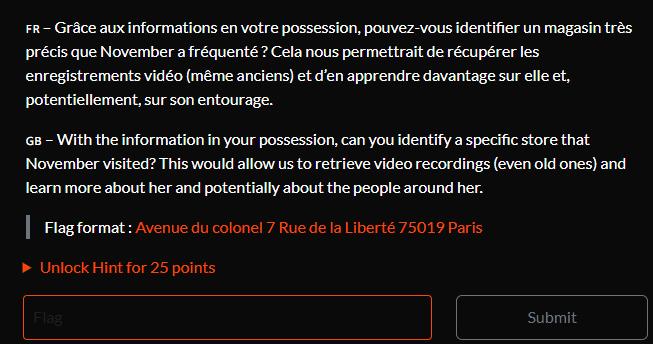

> Toujours avec le [Instagram](https://www.instagram.com/lgaudreau_/) de Léa, dans ses stories, on peut voir une photo de la boite d'un Iphone qu'elle a eu il y a un an.

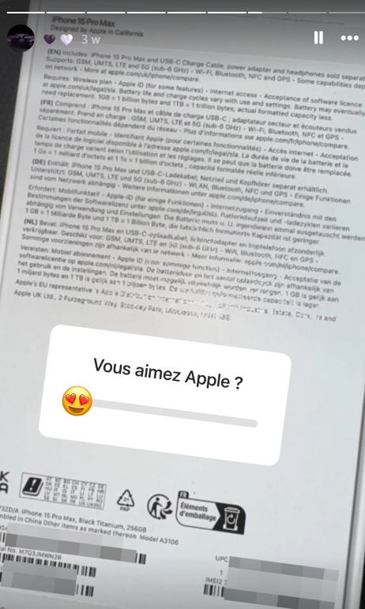

> La seule donnée non floutée est le numéro de série qu'on peut trouver avec [https://checkcoverage.apple.com/?locale=fr_FR](https://checkcoverage.apple.com/?locale=fr_FR).

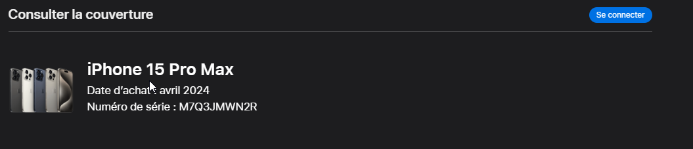

> Avec le [Google Calendar](https://calendar.google.com/calendar/u/0/embed?src=lea.gaudreau.pro@gmail.com) trouvé précédemment on cherche à cette date et on voit que le weekend du 18 au 20 avril 2024 elle était à Lyon.
> On sait que c'est une fan d'apple, elle va donc acheter directement en magasin et pas à la revente, et on sait aussi qu'elle était l'après-midi dans le 3ème arrondissement.

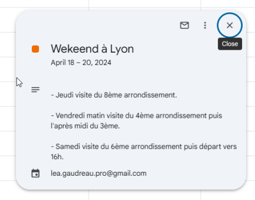

> Il n'y a qu'un seul AppleStore proche de cette zone.

**🎯 Flag :** `Centre commercial La Part-Dieu 17 Rue du Docteur Bouchut 69003 Lyon`

---

### 18. L'élément clé

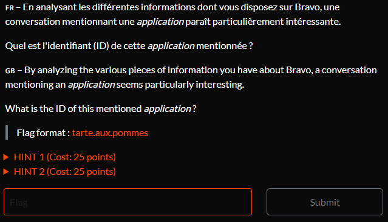

> En regardant le robots.txt (guessing) du site [https://mymemoriegram.xyz/](https://mymemoriegram.xyz/) on trouve le user-agent pour aller dans /private/

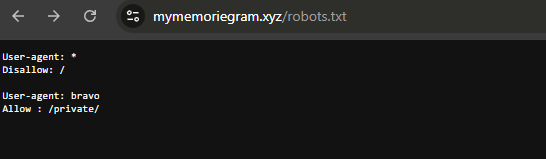

> Avec User-Agent Switcher on se connecte donc au /private/ avec le bon user et on a maintenant accès aux images.

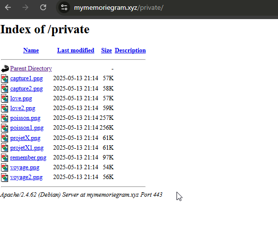

> Dans les screen on voit que ça parle d'une application de pêche de Mike.

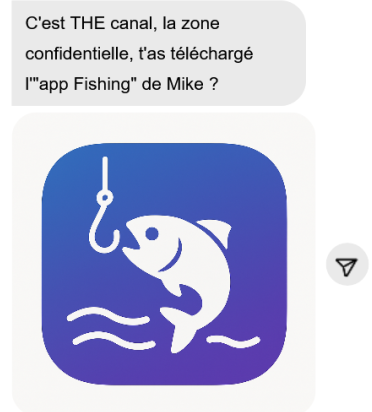

> En cherchant sur le PlayStore on finit par la trouver et dans l'url de appli on peut voir la réponse.

**🎯 Flag :** `com.hackosint.myapplicationn`

---

### 19. Communication

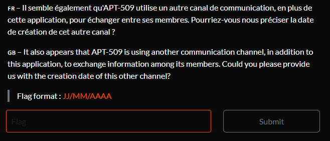

> Dans la FishingApp, en cliquant 3x sur Info (comme écrit dans les screen trouvés dans le /private/ au-dessus) on arrive sur un chat privé.
> Depuis le début du CTF les différents membres parlent d'un moyen de communication "T" plus secure, on tente donc l'adresse Telegram [https://t.me/APT509TMP](https://t.me/APT509TMP).
> En regardant l'historique du Telegram on voit que ça a commencé le 25/04/2025.

**🎯 Flag :** `25/04/2025`

---

### 20. Le cote obscur

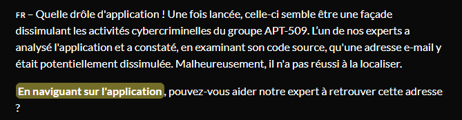

> En allait dans les infos de la FishingApp, il faut penser à la mettre en mode sombre, ce qui dévoilait l'adresse contact de Mike.

**🎯 Flag :** `str3etf1sher@mail.com`

---

### 21. Pardon vous etes

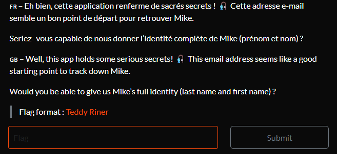

> On a maintenant un pseudo, str3etf1sher, un petit coup de [tool chez Zulu](https://usercheck.oscarzulu.org/) (merci les rhinos) et on trouve son [Mastodon](https://usercheck.oscarzulu.org/).
> On sait qu'il pêche avec November, et qu'il s'appelle Fabien Daucourt (F.Daucourt sur Mastodon, et elle disait Fabien dans sa story Snapchat).

**🎯 Flag :** `Fabien Daucourt`

---

### 22. Pseudonyme 2

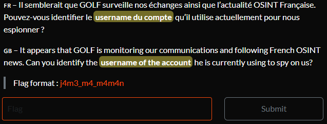

> Sur le [Telegram](https://t.me/APT509TMP) dans les médias il y a une image, et dessus on peut voir qu'il s'appelle G0lf7 sur Discord, et en le retrouvant on a aussi son pseudo :

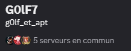

**🎯 Flag :** `g0lf_et_apt`

---

### 23. Home Sweet Home

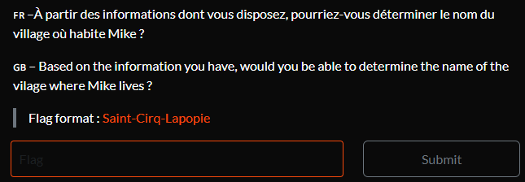

> En cherchant F Daucourt en dorkant on tombe sur un [site de pêche](https://absolu-peche.fr/profil/10018-f-daucourt).
> En regardant les lieux de pêches qui correspondent à sa description (le temps, l'emplacement, la boulangerie...) on tombe sur Dun-les-Places.

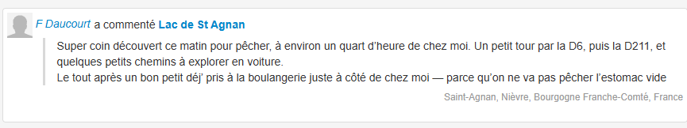

**🎯 Flag :** `Dun-les-Places`

---

### 24. Envole-toi

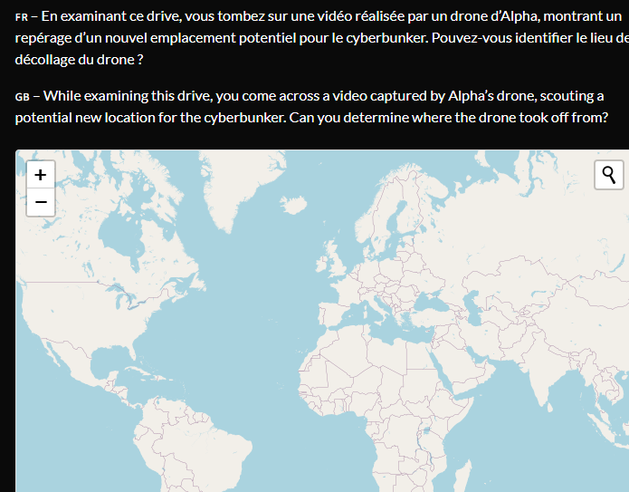

> Sur le [Telegram](https://t.me/APT509TMP), il y avait aussi un lien [Cryptpad](https://cryptpad.fr/drive/#/2/drive/edit/l2MS2EEV9OuI0mEnOo2rW7Xw/p/) avec un mot de passe, qu'on pouvait retrouver dans la conversation entre November et Bravo.

> Dans le Drive, en allant dans CYBERBUNKER, on trouve une lien [Vimeo](https://vimeo.com/1079165051/4addc0ed2c?share=copy).

> En faisant un reverse image du batiment sur la droite :

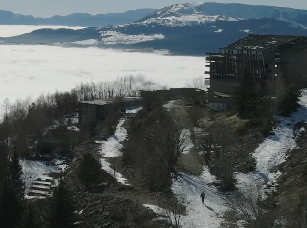

> On tombe sur [plusieurs site](https://www.naturimages.com/en/photo-essays/environment/saint-honore-1500---ski-resort-in-isere-abandoned-by-developers-enx1addedac7110000000001208.htm) parlant de Saint Honoré 1500.
> Sur Maps je m'assure que ça soit le bon endroit à l'aide du mur tagué qu'on voit au début de la vidéo.

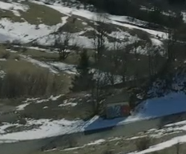

> En regardant où est le mur par rapport au drône on peut voir sur Maps que ça correspond à peu près au parking de Saint-Honoré.
> Au début de la vidéo on entend le bruit d'une voiture qui se gare, c'est donc le bon endroit.

**🎯 Flag :** 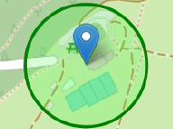

---

### 25. Objectif EAGLE

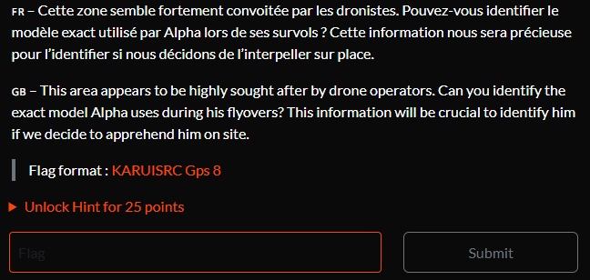

> Au bruit du drône qui décolle on sait que c'est un DJI, reste à trouver lequel.
> En sachant que le drône avait un Zoom x28, et au son au moment de l'envole, avec deux trois recherches Youtube on trouve le bon drône.

**🎯 Flag :** `DJI Mavic 3`

---

### 26. Nouvelle cible 2

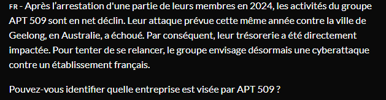

> Toujours dans le [Cryptpad](https://cryptpad.fr/drive/#/2/drive/edit/l2MS2EEV9OuI0mEnOo2rW7Xw/p/) on voit dans Target un PDF qui contient l'emplacement de leur cible.
> On enleve le filigrane pour une lecture plus simple.

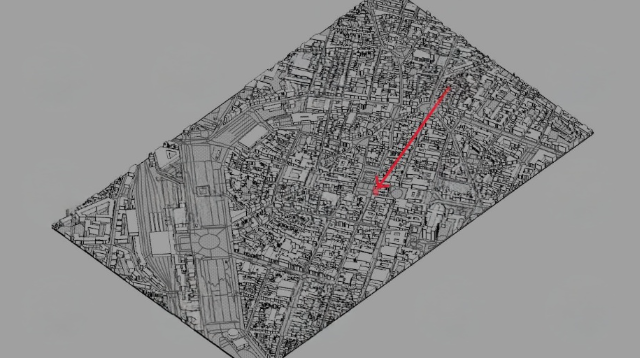

> On peut voir une gare, des ronds points, et surtout à coté de la gare un grand parvis/jardin avec une structure particulière.
> En cherchant on finit par trouver la gare de Reims.

Sur Maps, on peut reconnaitre facilement deux endroits collés au point rouge : 

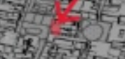

> On trouve donc que c'est le CIC.

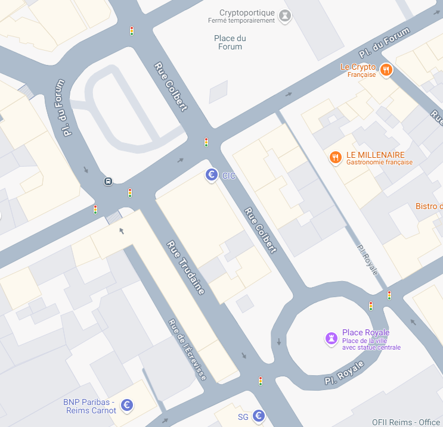

**🎯 Flag :** `Crédit Industriel et Commercial`

---

### 27. Petit bateau

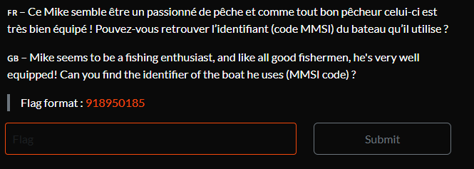

> Sur la page [absolute peche](https://absolu-peche.fr/profil/10018-f-daucourt) de Fabien, on voit un nom : "Seashell Injection".
> En le cherchant sur [Marine traffic](https://www.marinetraffic.com/en/ais/details/ships/shipid:9565794/mmsi:912010044/imo:0/vessel:SEASHELL_INJECTION#overview), on voit que son call sign est APT509, ce qui confirme que c'est le bateau qu'on cherche.
> Juste à coté, son MMSI.

**🎯 Flag :** `912010044`

---

### 28. Site vitrine 1

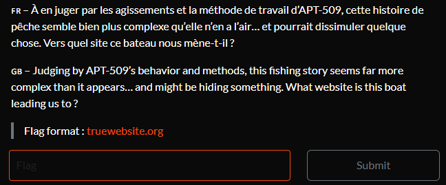

> Dans les vessel characteristics du site [Marine traffic](https://www.marinetraffic.com/en/ais/details/ships/shipid:9565794/mmsi:912010044/imo:0/vessel:SEASHELL_INJECTION#overview), on trouve une url : https://loueuneencre.online

**🎯 Flag :** `loueuneencre.online`

---

### 29. L'allié

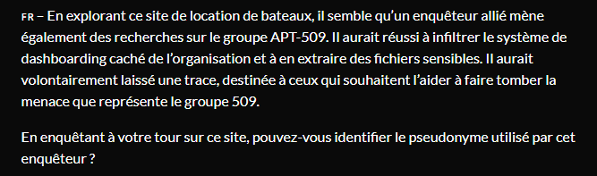

> En guessing, on a trouvé que [https://loueuneencre.online/dashboard.html](https://loueuneencre.online/dashboard.html) fonctionnait.
> En fouillant dans les commande disponible, on tente alerte :

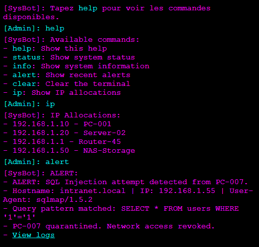

> Le "view logs" ne semble pas cliquable dans un premier temps mais avec un clic molette (nouvelle onglet), on arrive à atteindre les archives (source croisée avec celle du code source).

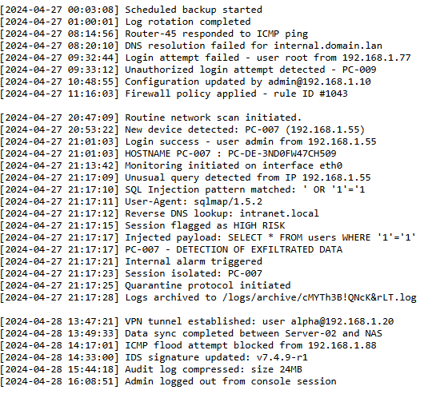

**🎯 Flag :** `3ND0FW47CH509`

---

### 30. Jour J

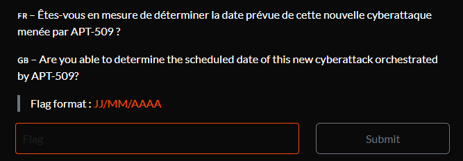

> Dans le dossier Target, il y avait aussi un fichier "daterevendication-secure.glb"
> En l'ouvrant on voit un renard avec plein de mots en Japonais dessus.
> Sous ses pattes, une date.

**🎯 Flag :** `17/07/2025`

---

### 31. Mine d'or

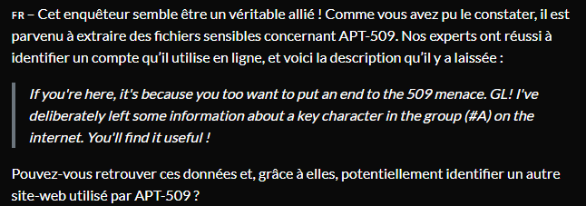

> On sait maintenant le pseudo qu'on cherche, en voyant le format du flag ".carotte" on a su qu'il faudrait un .onion (pour Tor par exemple).
> Un site qui est souvent associé un .onion est Pastebin, et en cherchant à l'url https://pastebin.com/u/3ND0FW47CH509 puis [https://pastebin.com/u/3ND0FW47CH](https://pastebin.com/u/3ND0FW47CH) on tombe sur le sien.
> A l'intérieur une note :

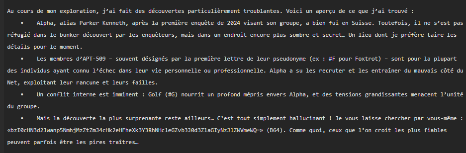

> On dechiffre avec [CyberChef](https://gchq.github.io/CyberChef/#recipe=From_Base64('A-Za-z0-9%2B/%3D',true,false)&input=YnpJMGNITjNkMkp3YW5wNU5taGpNelp0Wm1KNGNIazJlSEZoZVhrM1kzUmhOSGMxZUdadmIzSjBkM1psYUdJeU56SmxaV1ZtZVdRPQ&oeol=FF), et on recupère l'adresse onion.

**🎯 Flag :** `o24pswwbpjzy6hc36mfbxpy6xqayy7cta4w5xfoortwvehb272eeefyd`

---

### 32. L'oublié(e)

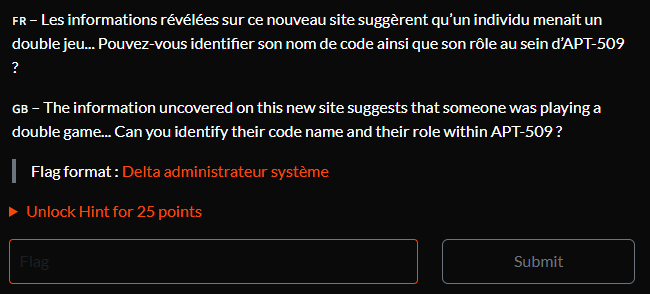

> En arrivant sur le .onion on tombe sur un site ou on n'a acces à rien.

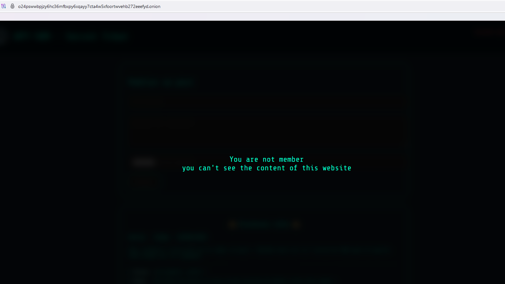

> En regardant dans le code source on voit une balise "access-blocker", et en la retirant dans "Inspecter", on arrive à tout voir.

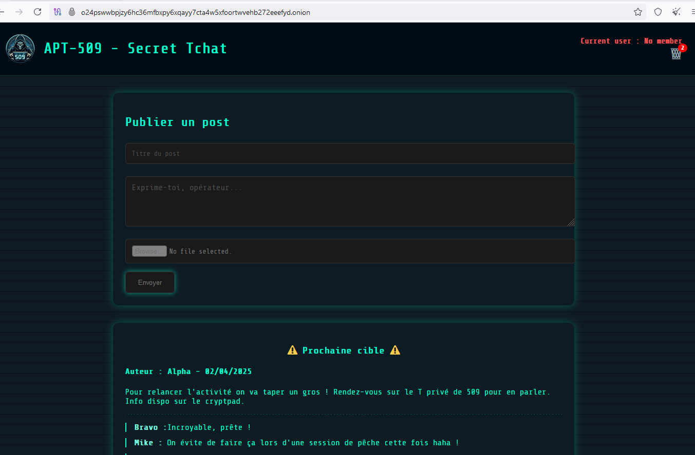

> Il fallait ensuite penser à aller sur [archive.js](https://archive.ph/mRpDW) pour regarder un snapshot du site où on voit toutes les informations qu'il nous manquait.

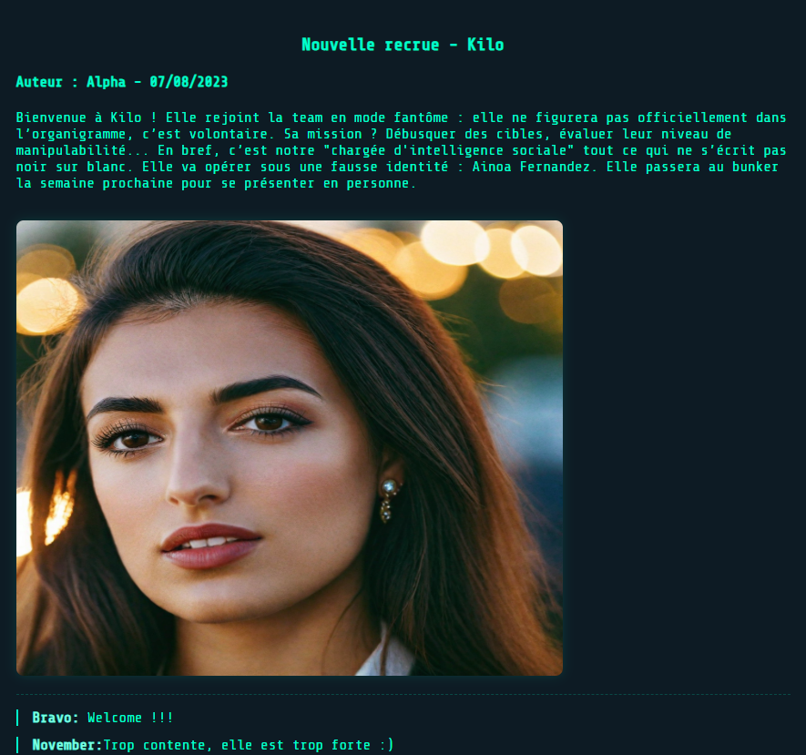

**🎯 Flag :** `Kilo chargée d’intelligence sociale`

---

### 33. Une drôle d'entreprise

> Dans le [Cryptpad](https://cryptpad.fr/drive/#/2/drive/edit/l2MS2EEV9OuI0mEnOo2rW7Xw/p/) toujours, il y a un devis (format .docx)
> En analysant les metadadonnées du document on trouve "destinataire : betaoespatulaparker"

**🎯 Flag :** `Betao Espatula Parker`

---

### 34. Site vitrine 2

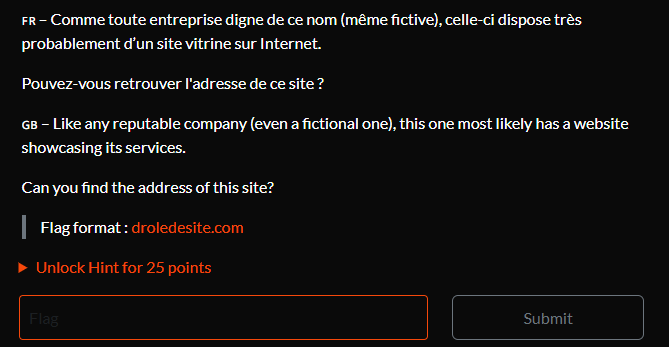

> Avec le nom qu'on a maintenant on va voir sur [Whoxy](https://www.whoxy.com/keyword/betaoespatulaparker)
> On trouve deux domaines qu'on cherche sur [Censys](https://search.censys.io/search?resource=hosts&sort=RELEVANCE&per_page=25&virtual_hosts=EXCLUDE&q=betaoespatulaparker.eu)

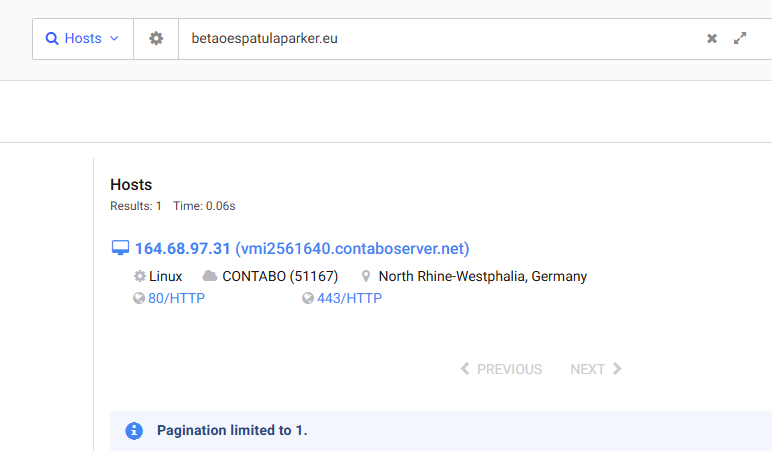

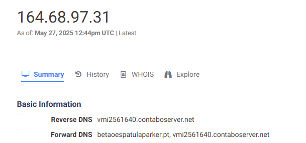

> On a donc l'adresse [vmi](http://vmi2561640.contaboserver.net/) qui nous envoie vers le site, ce qui valide ce qu'on avait au-dessus.

**🎯 Flag :** `betaoespatulaparker.eu`

---

### 35. Discretion assuree

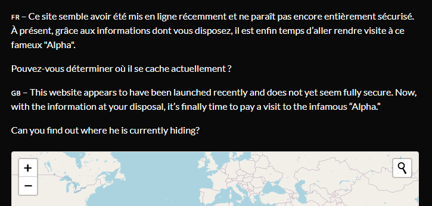

> En repartant du site qu'on vient de trouver, on regarde le /robots.txt

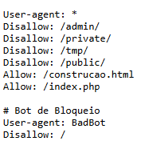

> On trouve un /index.php accessible et en cherchant dedans on trouve des comptes rendus de réunion (en esquivant encore un rickroll).

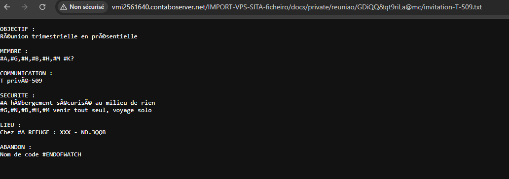

> Après avoir abandonné le code du lieu ne sachant pas quoi en faire, on a décidé de s'y replonger dessus.
> On finit par trouver que c'est du geocode et on tombe sur [mapcode](https://www.mapcode.com/)
> Après s'être rendu dans le North Dakota on a finit par se dire que le XXX dans le .txt à coté du code pourrait signifier FRA.
> On tape le code, et on tombe sur une petite cabane isolée en France.

**🎯 Flag :** 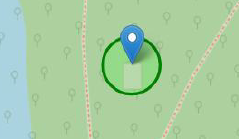

---

### 36. TocTocToc

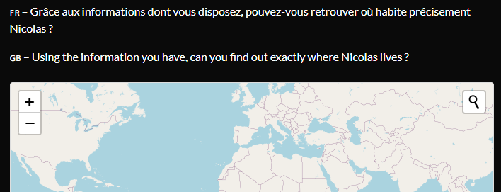

> On arrive au pire challenge, qu'on a eu très rapidement au début du CTF, et qui a donné mal au crâne à 99% des participants (j'entends encore le bruit dans ma tête).
> On reprend tout ce qu'on savait sur Nicolas, son [Facebook](https://www.facebook.com/profile.php?id=61576075067801&sk=friends), son [Bluesky](https://web-cdn.bsky.app/profile/xnicolasht.bsky.social/) et les informations du [cryptpad](https://cryptpad.fr/drive/#/2/drive/view/f3YGBpPsdLVDxwpvH+PfWsHBS2nNHpOgLwGr-VP9cHI/).
> La résolution va paraitre simple mais avant de savoir vraiment quoi chercher ça partait dans tout les sens.
> En cherchant Lycée privé Saint-Joseph, on en trouve 4 dans l'Ain : à Bourg-en-Bresse, Oyonnax, Saint-Didier-sur-Chalaronne et Miribel.
> C'est parti pour rechercher sur [WayBack](https://web.archive.org/) dans les actualités des 4 sites des 4 villes...
> On finit par trouver un snapshot pour Miribel qui parle de la rue Pellera.
> Dans [StreetView](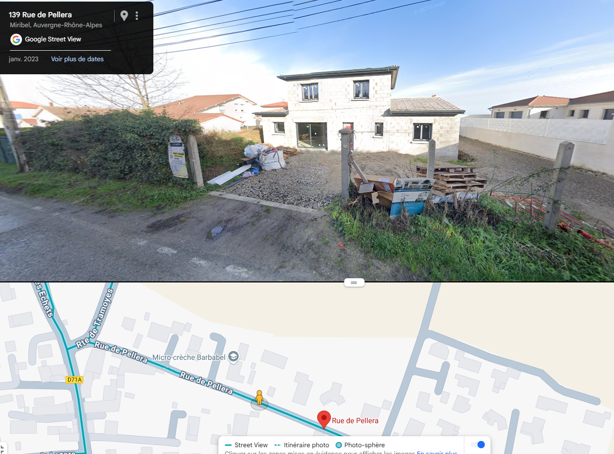 on retrouve une maison en construction en 2023 qui correspond à tout ce qu'on avait comme information.

**🎯 Flag :** 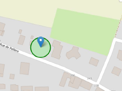

---

### 37. Challenge Indefini

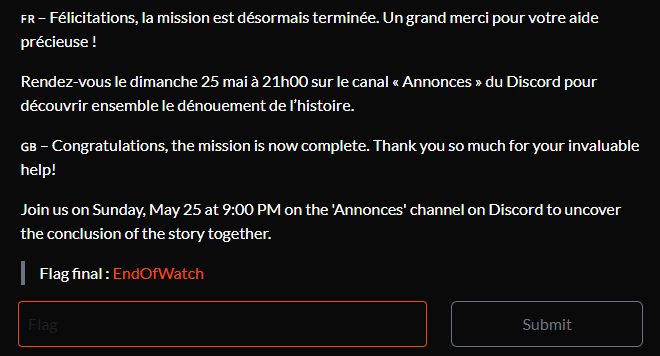

> Fin du CTF !

**🎯 Flag :** `EndOfWatch`

---

## Techniques utilisees

Voici un récapitulatif des techniques, outils, sites et pivots utilisés tout au long du CTF :

### 🌐 Recherche web & réseaux sociaux

- Investigation d’identités numériques :
  - Facebook, Instagram, Threads, Mastodon, Bluesky
  - Recherche croisée sur :
    - [idcrawl.com](https://idcrawl.com)
    - [usercheck.oscarzulu.org](https://usercheck.oscarzulu.org)
    - [instantusername.com](https://instantusername.com)
- Exploration de profils divers :
  - Chess.com, Vinted, TripAdvisor, MyAtlas
- Recherche dans :
  - [Medium](https://medium.com)
  - [Linktree](https://linktr.ee)
  - Google Calendar public
- Analyse d’éléments de profil :
  - Bios, stories, publications, tags, métadonnées sociales
- Recherche avancée sur Telegram :
  - Historique de messages, médias partagés, pseudonymes

---

### 🧠 Analyse sémantique & pivot logique

- Lecture attentive d’interviews, stories et dialogues (Cryptpad)
- Déduction d’identités, relations, lieux, dates à partir de :
  - Objets visibles (t-shirt, tatouage, drapeau, etc.)
  - Conversations privées et publiques
- Croisements multi-sources (Facebook + Cryptpad + Threads, etc.)

---

### 🕵️‍♂️ Investigation technique & fichiers

- Analyse de documents et métadonnées :
  - `.glb`, `.docx`, `.pdf`, `.txt`, images
- Décodage de contenus :
  - QR Codes, code-barres, cartes vitales, tatouages
- Extraction de données via code source :
  - `robots.txt`, chemins cachés (`/private/`, `/logs/`, `/dashboard.html`, etc.)
  - Lecture conditionnelle (mode sombre pour révéler du contenu)

---

### 🧩 Analyse de sites et interactions serveur

- User-Agent spoofing pour contourner des restrictions d’accès
- Exploration manuelle de fichiers cachés ou non liés :
  - Guessing d’URL (`/view_logs`, `/archives`, `/index.php`, etc.)
  - Lecture du code HTML/JS pour extraire des chemins ou fonctions inactives
- Recherche via services WHOIS/DNS :
  - [Whoxy](https://www.whoxy.com)
  - [Censys](https://search.censys.io)

---

### 🌍 Géolocalisation & GEOINT

- Recherche d’images inversées (Google Images, reconnaissance visuelle)
- Croisement d’informations visuelles avec Google Maps / Street View
- Analyse de vidéos Vimeo pour repérer un lieu via perspective et sons ambiants
- Identification de lieux à partir de détails mineurs (ex : boulangerie, tag, mur, etc.)

---

### 🚢 Pistes maritimes & infrastructure

- Recherche d’un navire via [MarineTraffic](https://www.marinetraffic.com)
  - MMSI, nom du bateau, call sign, lien vers un site vitrine
- Identification d’infrastructures dissimulées :
  - IP publiques de serveurs, chemins internes

---

### 💬 Plateformes secondaires & messageries

- Cryptpad (fichiers, conversations)
- Telegram (groupes, fichiers joints, dates)
- WhatsApp (via numéro extrait d’une image)
- Analyse indirecte de Discord, via captures d’écran

---

### 🧠 Typologie des OSINT mobilisés

- **OSINT Humain** : relations personnelles, doubles identités, pseudonymes
- **OSINT Réseau** : fouille de sites web, fichiers cachés, IP/serveurs
- **OSINT Lieu** : géolocalisation d’après indices photo/vidéo
- **OSINT Documentaire** : PDF, métadonnées, devis, captures
- **OSINT Social Media** : Facebook, Threads, Bluesky, Instagram, Vinted
- **OSINT Technique** : reverse léger, détection d’interfaces, paramètres d’app

---

<!-- Hashtags pour référencement -->
#OSINT #Cybersecurity #CTF #ThreatIntelligence #Investigation #Renseignement
