# Write-up – Medileak 2

_Type : CTF OSINT  
Date : Mai 2025  
Classement 🥇 : **Top 17/134** en étant premier des personnes seules (équipe de 4 sinon), 22 équipes ont fini au total_

_Réalisé en solo sous le nom d'équipe **OneForAll** (même si je dis nous/je/on)_

_Tous les flags ne sont pas dans le meilleur ordre possible, mais c'est l'ordre dans lequel je les ai trouvé. Il n'y a évidement pas la finale._

## 📌 Sommaire

- [#Intro](#1-intro)
- [#legacy](#2-legacy)
- [#reboot](#3-reboot)
- [#notcyprus](#4-notcyprus)
- [fanclub](#5-fanclub)
- [NewJob](#6-newjob)
- [IciCaRecrute](#7-icicarecrute)
- [#NewPartner](#8-newpartner)
- [#Historique](#9-historique)
- [#MauvaiseNouvelle](#10-mauvaisenouvelle)
- [#TropTard](#11-troptard)
- [#Source](#12-source)
- [#Modem](#13-modem)
- [#medileak](#14-medileak)
- [#TeamFLS-1](#15-teamfls-1)
- [#TeamFLS-2](#16-teamfls-2)
- [#Hack](#17-hack)
- [#MasterMind](#18-mastermind)
- [#backtobusiness](#19-backtobusiness)
- [#MaisonMère](#20-maisonmère)
- [#MaiSonPère](#21-maisonpère)
- [#MaisonChère](#22-maisonchère)
- [#TeamFLS-3](#23-teamfls-3)
- [#RadioGaga](#24-radiogaga)
- [#MeetMe](#25-meetme)
- [#Halftime](#26-halftime)
- [#PasSympa](#27-passympa)
- [#Soldes](#28-soldes)
- [#AvisNégatif](#29-avisnegatif)
- [#Fl4G(Bonus)](#30-flag)
- [#OldLove](#31-oldlove)
- [#Clochint (Bonus)](#32-clochint)
- [#Insécurité](#33-insecurite)
- [#LesBonsComptes](#34-lesbonscomptes)
- [#Mission](#35-mission)
- [#IA](#36-ia)
- [#Malins](#37-ia)
- [#SoyonsDésinvoltes](#38-soyonsdesinvoltes)
- [#HomeSick](#39-homesick)
- [#END](#40-end)
- [Tous les challenges](#tous-les-challenges)
- [Toutes les techniques utilisées](#toutes-les-techniques-utilisees)
  
### 1. #Intro
 
>  Réponse dans la phrase, il suffit de la réécrire

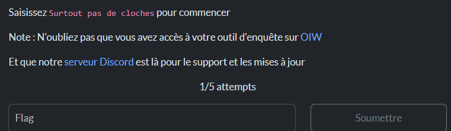

**🎯 Flag :** `Surtout pas de cloches`

---

### 2. #legacy

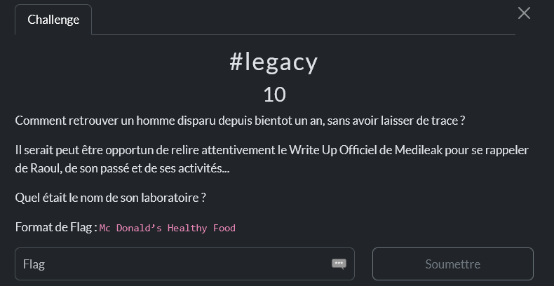

> Dans ce cas, il suffit de revenir à l'ancienne description du premier [Medileak](https://oscarzulu.org/wu-medileak/) et de trouver le nom à l'intérieur.

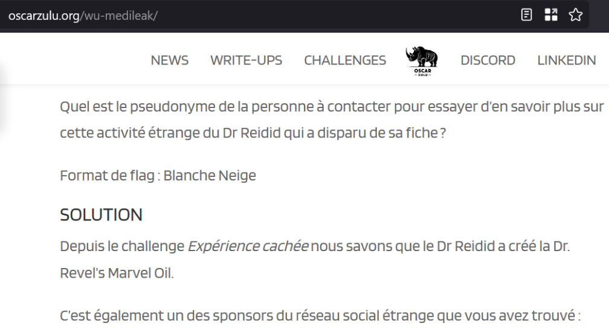

**🎯 Flag :** `Dr. Revel’s Marvel Oils`

---

### 3. #reboot

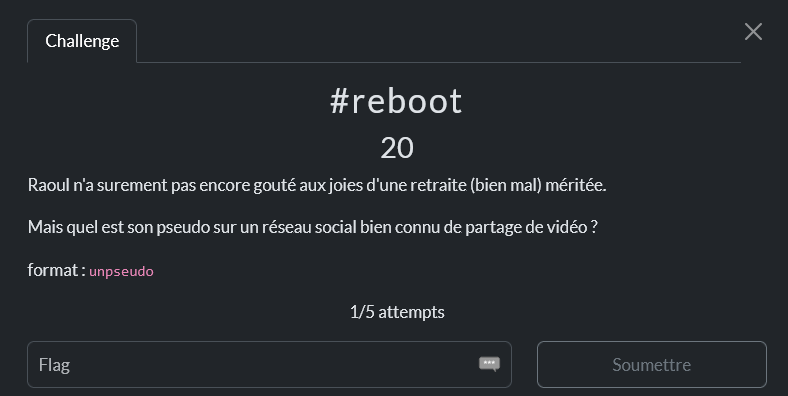 

> J'ai d'abord essayé sur Youtube et je n'ai rien trouvé, alors je suis allé sur Tiktok et j'ai tapé Dr Revel et je suis tombé sur son [compte](https://www.tiktok.com/@drrevelmarveloil) .

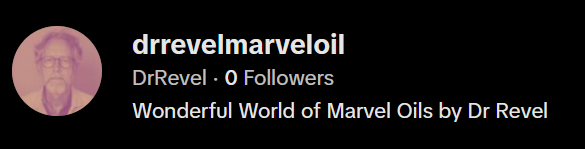

**🎯 Flag :** `drrevelmarveloil`

---

### 4. #notcyprus

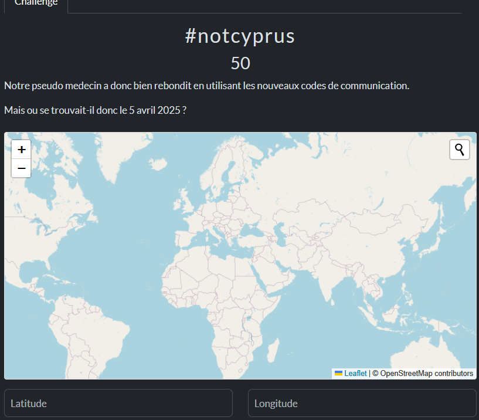

> En cherchant sur son [tiktok](https://www.tiktok.com/@drrevelmarveloil/video/7489168481376652566), on voit que son appartement est en face d'une tour, avec un revere image on trouve qu'il s'agit de la Tour Al Manara (Dubaï), on cherche le bâtiment blanc en forme de U en face, et on met le point sur la carte là où il devrait être (Damac Zada Tower).

**🎯 Flag :** 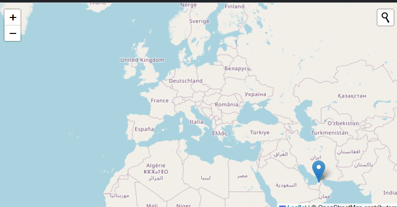

---

### 5. #fanclub

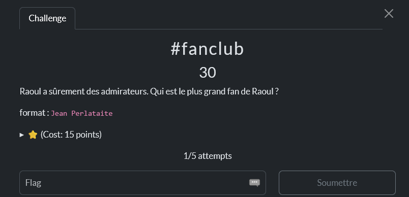

>  Dans les commentaires, un pseudonyme revient souvent : celestin_aitoubib.
> Une visite sur le site d'[AI Toubib](https://aitoubib.fr/) révèle non seulement que c'est là que travaille Raoul (Dr Revel), mais aussi que son PDG est Celestin Marchevend.
> La plupart des profils trouvées jusqu'à maintenant ont l'air d'avoir des Bluesky, il y a donc surement des pivots autours de ça.

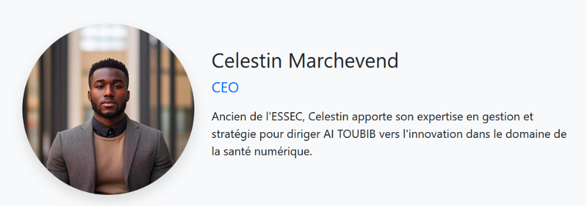

**🎯 Flag :** `Celestin Marchevend`

---

### 6. #NewJob

>  Comme indiqué ci-dessus, le nom commercial de l'entreprise est [AI TOUBIB](https://aitoubib.fr/).

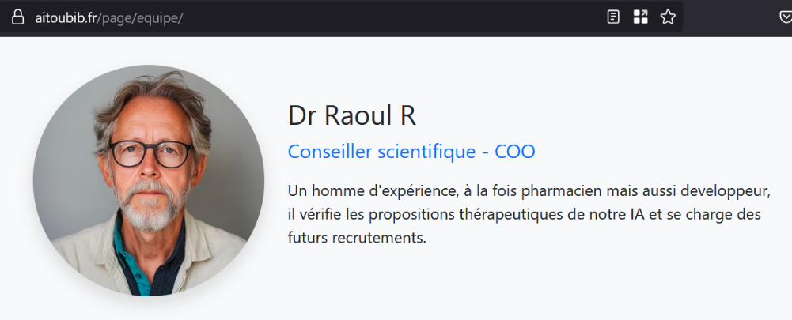

**🎯 Flag :** `AITOUBIB`

---

### 7. #IciCaRecrute

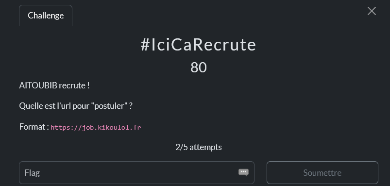

> En allant dans la section « Actualités », on voit qu'ils recherchent un nouveau directeur technique, et en allant sur [l'offre d'emploi](https://aitoubib.fr/page/offre-demploi-cto/), on voit le site sur lequel postuler.

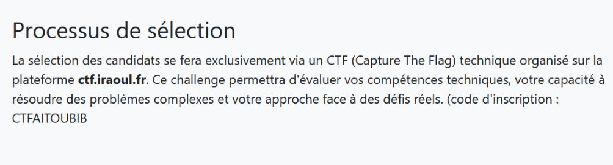

**🎯 Flag :** `https://ctf.iraoul.fr` (et pas de / à la fin)

---

### 8. #NewPartner

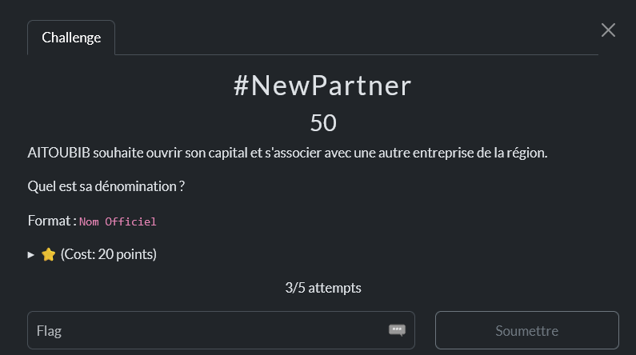

> Ce flag est un croisement entre deux sites : https://mediprecog.eu/histoire.html et https://finint.ninja.
> Le premier site peut être trouvé en regardant les nouvelles sur [AI Toubib](https://aitoubib.fr/page/actualites/), un lien qui parle d'un partenariat avec Mediprecog nous amène à [cet article](https://mednews.tech/2025/04/mediprecog-envisage-un-investissement-dans-ai-toubib-une-phase-de-test-strategique-en-cours/).
> On tombe sur leur site https://mediprecog.eu/ où un seul onglet est cliquable : [Notre histoire](https://mediprecog.eu/histoire.html).
> On trouve trois noms différents pour la société au cours des années : Précision Médicale, Boutevieux Médical et Mediprecog.
> Une visite sur finint.ninja révèle que le nom correct est [Boutevieux Médical](https://finint.ninja/companies/boutevieux-medical-none/).

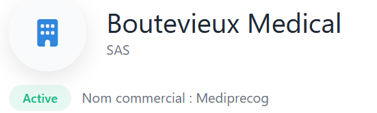

**🎯 Flag :** `Boutevieux Medical`

---

### 9. #Historique

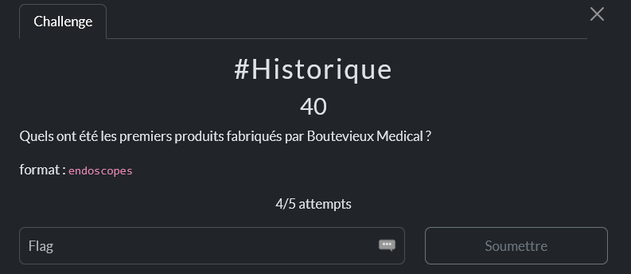

>  En découvrant sur [finint.ninja](https://finint.ninja/companies/boutevieux-medical-none/) que l'entreprise est Boutevieux Médical depuis 1953, on retourne sur l'historique de l'entreprise sur [Notre Histoire](https://mediprecog.eu/histoire.html) et on se rend compte que le produit est un sphygmomanomètre.

**🎯 Flag :** `sphygmomanomètres`

---

### 10. #MauvaiseNouvelle

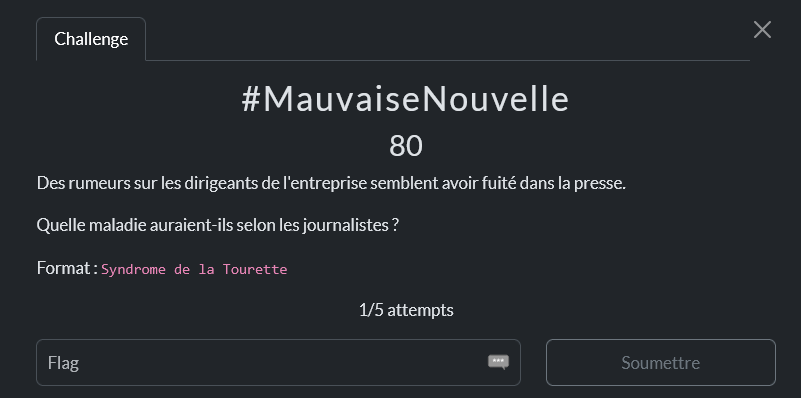

>  En cherchant sur Mednews avec Boutevieux on tombe sur un [article](https://mednews.tech/2025/05/mediprecog-denonce-une-tentative-de-destabilisation-orchestree-a-travers-des-diagnostics-medicaux-falsifies/) qui explique qu'ils sont au coeur d'une affaire avec la maladie de Huntington.

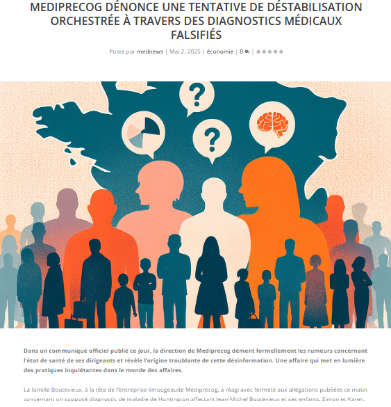

**🎯 Flag :** `Maladie de Huntington`

---

### 11. #TropTard

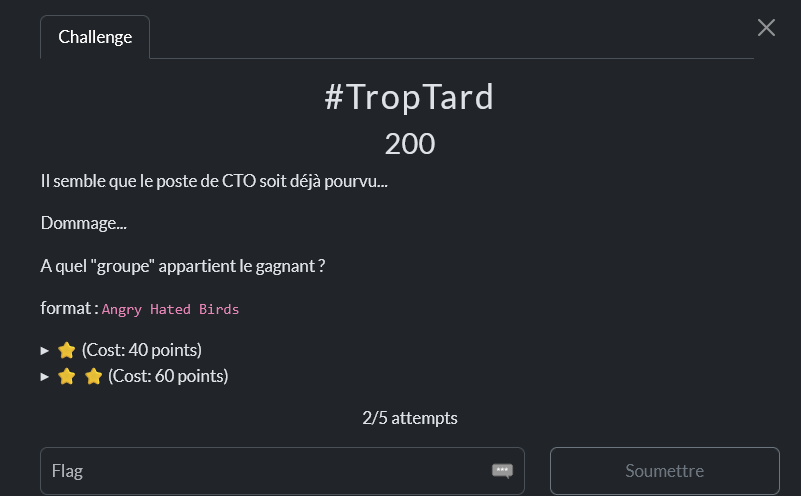 

> À partir de ce moment, je ne vois pas d'autre solution que de faire le CTF à l'adresse https://ctf.iraoul.fr. On n'oublie pas qu'il s'agit essentiellement d'un CTF OSINT et que Stegano, Crypto et autres divertissements ne sont pas nécessairement à la portée de tout le monde... Il existe donc une alternative ailleurs.

> En se promenant, on tombe sur https://gitlab.com/marshack, qui a toutes les réponses en se baladant entre les différentes années de write-ups

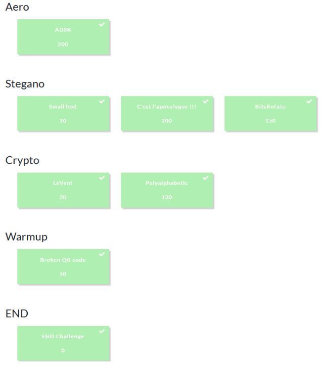

> Et on débloque le dernier défi où il est dit :

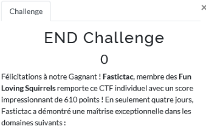

> Comme on connaît le nouveau CTO sur la page AI Toubib (Lucas Tranolond), on sait maintenant que son pseudonyme est « Fastictac », membre du groupe « Fun Loving Squirrels ».

**🎯 Flag :** `Fun Loving Squirrels`

---
   
### 12. #Source

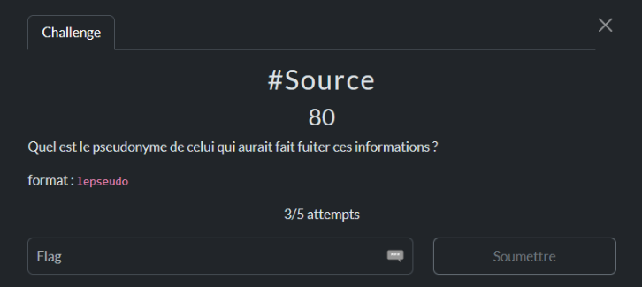

> En connaissant le nom de ce groupe et en cherchant un peu, nous tombons sur [leur site](https://funlovingsquirrels.wordpress.com/) et sur les contacts, nous trouvons une adresse IP.

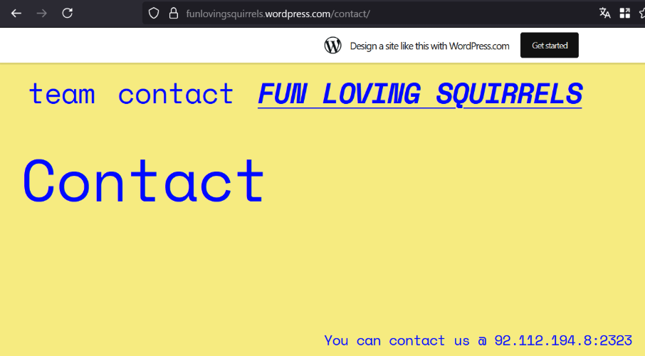  

> Une connexion Telnet révèle des discussions internes.

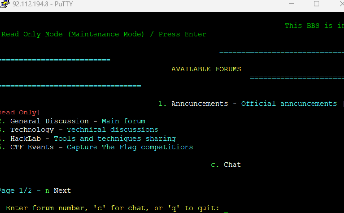

> Lucas est donc finalement un agent double qui travaille pour les concurrents Tchèques, Advanced Medical Systems... A l'aide de plusieurs personnes.

**🎯 Flag :** `Fastictac`

---

### 13. #Modem

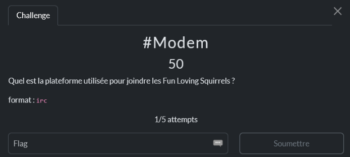 

> Sur l'écran d'accueil, on voit mentionné **BBS**.

**🎯 Flag :** `bbs`

---

### 14. #medileak

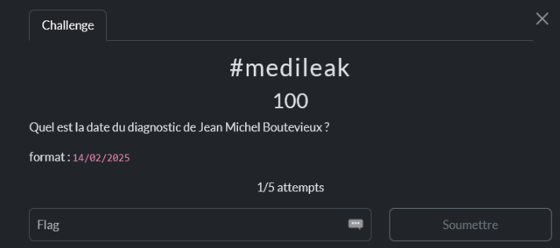  

> En continuant à chercher sur le bbs, on tombe sur une conversation ou une partie avec des fichiers `xsf` existerait. On tape donc « xsf » au lieu des numéros qu'ils proposent et bingo.

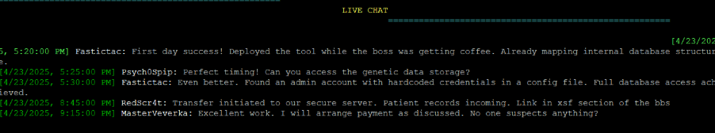  

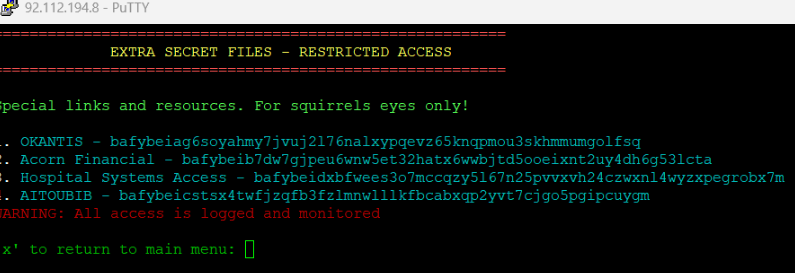 

> On voit que ce hash est stocké sur IPFS, on va donc regarder le [hash d'AI TOUBIB](https://bafybeicstsx4twfjzqfb3fzlmnwlllkfbcabxqp2yvt7cjgo5pgipcuygm.ipfs.dweb.link/).

> En combinant sa date de naissance sur finint.ninja (26/05/1959), et les fichiers csv de diagnostic et de patient, on trouve que la date de diagnostic est 20220308.

**🎯 Flag :** `08/03/2022`

---

### 15. #TeamFLS-1

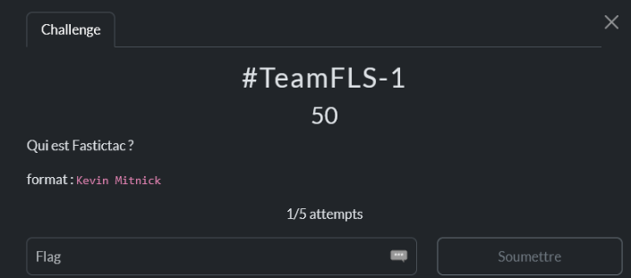

>  Nous savons depuis un certain temps qu'il s'agit de Lucas Tranolond.

**🎯 Flag :** `Lucas Tranolond`

---

### 16. #TeamFLS-2

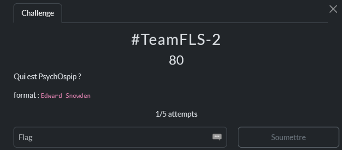  

> Grâce à [usercheck.oscarzulu.org](https://usercheck.oscarzulu.org/), on remonte jusqu'à un profil Steam.

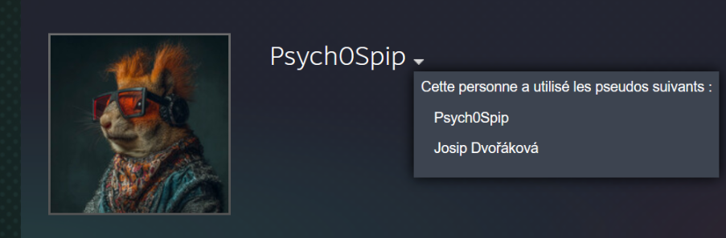

> Lucas est donc avec le fils de Zoran, jumeau de Vesna qui travaille elle aussi pour AI Toubib (trouvable [ici](https://finint.ninja/companies/sci-beau-soleil-none/) ).

**🎯 Flag :** `Josip Dvořáková`

---

### 17. #Hack

> On explore les fichiers `.xsf` trouvés, [un seul](https://ipfs.io/ipfs/bafybeib7dw7gjpeu6wnw5et32hatx6wwbjtd5ooeixnt2uy4dh6g53lcta) est parlant et correspond à la demande.

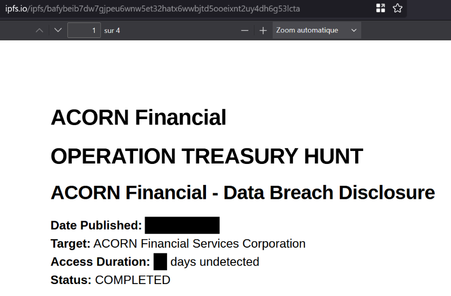

**🎯 Flag :** `ACORN Financial`

---

### 18. #MasterMind

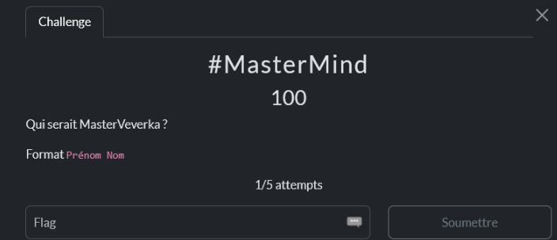

> Vu la façon dont MasterVeverka parle sur le bbs, on est sûr qu'il est à la tête de la société concurrente Advanced Medical Systems (trouvée sur [MedNews](https://mednews.tech/2025/04/advanced-medical-system-le-geant-tcheque-qui-convoite-mediprecog/)). On recherche donc cette société sur [finint.ninja](https://finint.ninja) et on trouve un document contenant les statuts de la société. Sur la dernière ligne, sa signature.

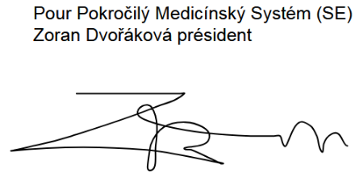

**🎯 Flag :** `Zoran Dvořáková`

---

### 19. #backtobusiness

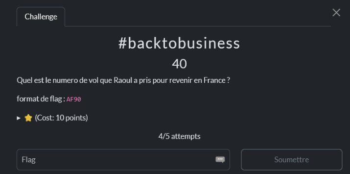  

> Sur le tiktok de Raoul, le 10/04/2025, il explique qu'il retourne à Limoges.
> En regardant les avions ce jour-là, il y en a 3 (les métadonnées donnaient la date du 06/04 à 10h15, mais je ne sais pas s'il faut l'utiliser).
> Après quelques tentatives infructueuses (je n'ai pas réussi à trouver comment tomber dessus la première fois), nous avons trouvé le drapeau.

**🎯 Flag :** `EK73`

---

### 20. #MaisonMère

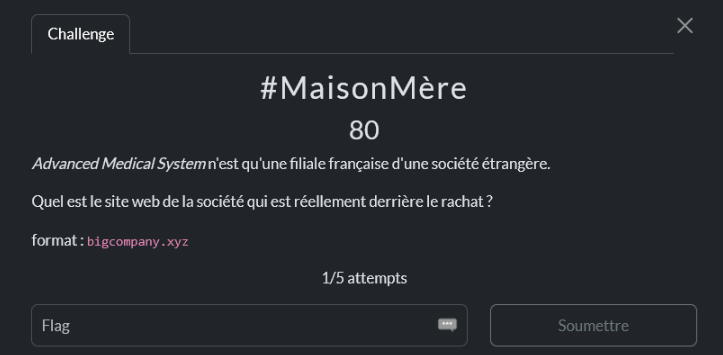 

> [finint.ninja](https://finint.ninja/companies/advanced-medical-system-none/) montre qu'Advanced Medical Systems est détenu à 100 % par Pokročilý Medicínský Systém.

> Mednews nous dit que cette société est tchèque. Nous écrivons donc le nom dans l'url (guessing) sans accents et ajoutons .cz, et nous trouvons un site qui existe [bel et bien](https://pokrocilymedicinskysystem.cz/).

**🎯 Flag :** `pokrocilymedicinskysystem.cz`

---

### 21. #MaiSonPère

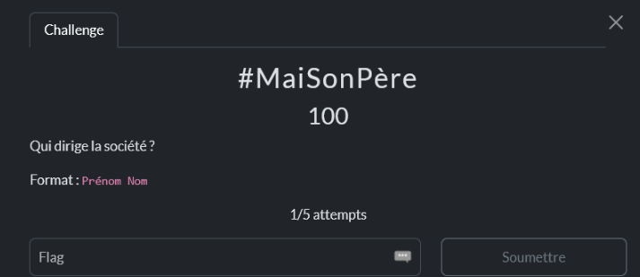

> On l'a déjà depuis longtemps.

**🎯 Flag :** `Zoran Dvořáková`

---

### 22. #MaisonChère

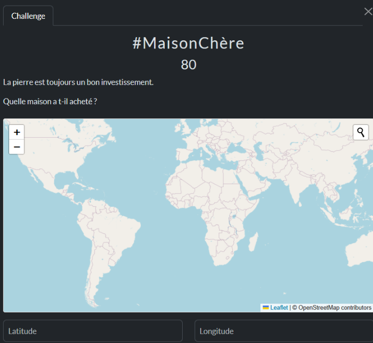  

> Sur [finint.ninja](https://finint.ninja/companies/advanced-medical-system-none/), les coordonnées d'AMS mènent à un château sur Google Maps.

  

> On tombe sur un château (ce qui correspond parfaitement au jeu de mots du nom du défi). 

**🎯 Flag :** 

---

### 23. #TeamFLS-3

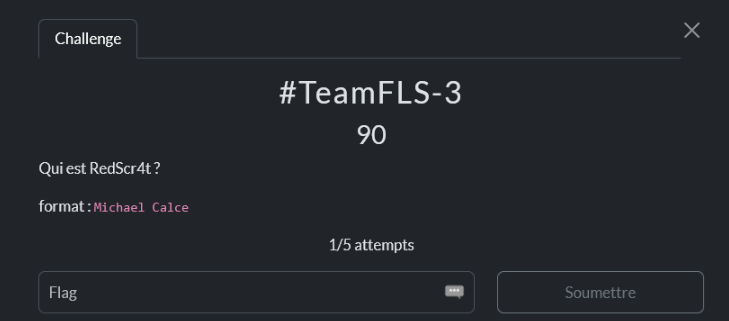

> En faisant des WebCheck si tous les sites, j'ai fini par tomber sur une information importante sur [pokrocilymedicinskysystem.cz](https://web-check.xyz/check/https%3A%2F%2Fpokrocilymedicinskysystem.cz%2F).

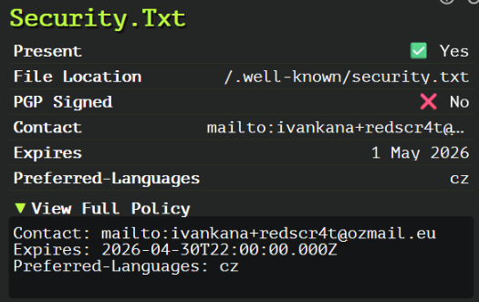

> Comme tous les personnages depuis le début on un Bluesky, on va voir pour lui aussi et en tapant son nom on trouve.

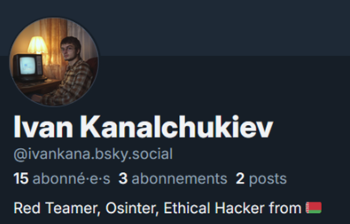

**🎯 Flag :** `Ivan Kanalchukiev`

---

### 24. #RadioGaga

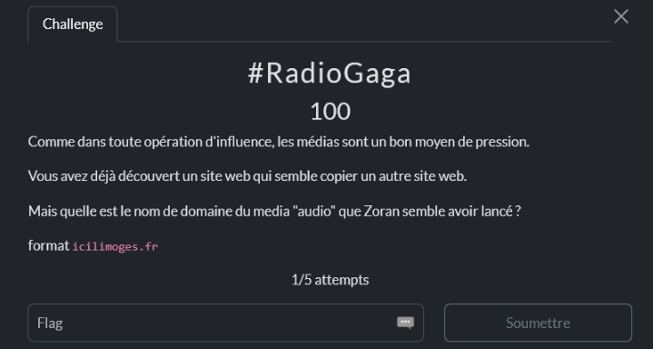

> Une chose que je n'avais pas encore tenté du CTF est d'utiliser OIW pour les [lieux](https://medileak2.oiw.fr/dashboard/locations), en ayant trouvé Chez le Rat j'essaye ce code et ça marche
> On se met à parler avec Pierre le jardinier qui nous donne des informations importantes sur la vie de Zoran et sa famille. Il confirme qu'il a bien des jumeaux, mais aussi une femme... Andrea.

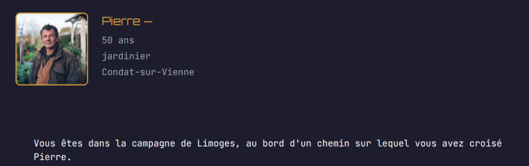

> Il nous dit que Zoran essaierait de lancer une radio "La voix de l'Europe".
> En cherchant je trouve que voiceofeurope.com existe, et avec du guessing je finis par trouver que https://lavoixdeleurope.eu/ existe aussi.

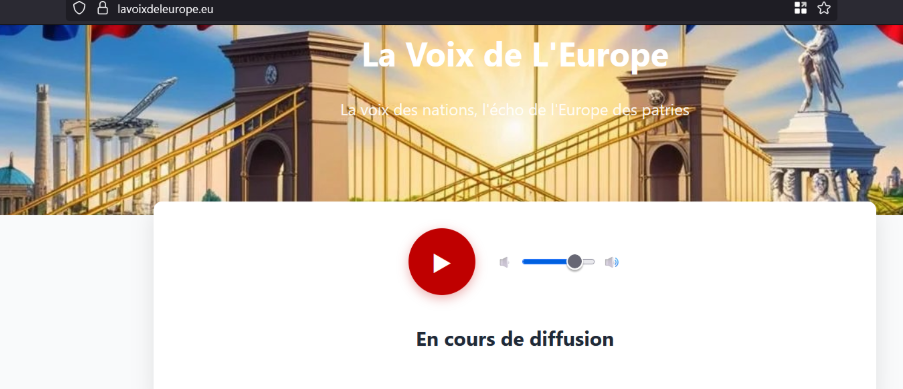

**🎯 Flag :** `lavoixdeleurope.eu`

---

### 25. #MeetMe

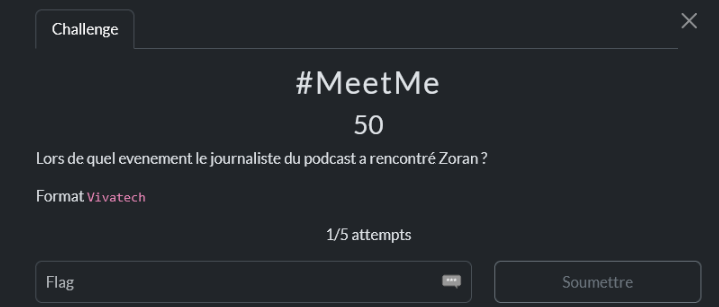

> En continuant les recherches cotés Zoran, je trouve que sur la société [Advanced Medical Systems](https://finint.ninja/companies/advanced-medical-system-none/) il y a deux personnes que je n'ai pas encore recherché : M. Alec BOUCHARDIN et M. André FEUILLATON
> Ils ont eux aussi un Bluesky et en regardant du coté de André on trouve un événement

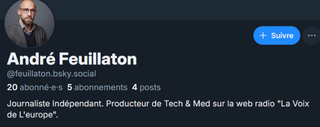

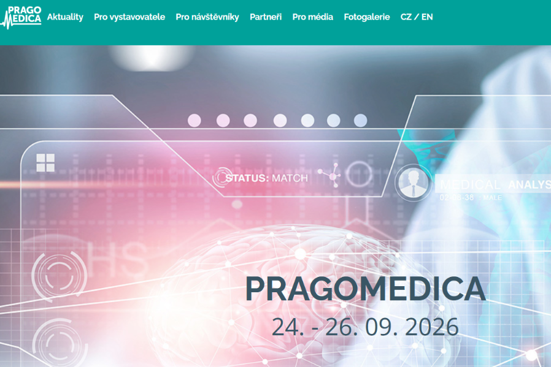

**🎯 Flag :** `pragomedica`

---

### 26. #Halftime

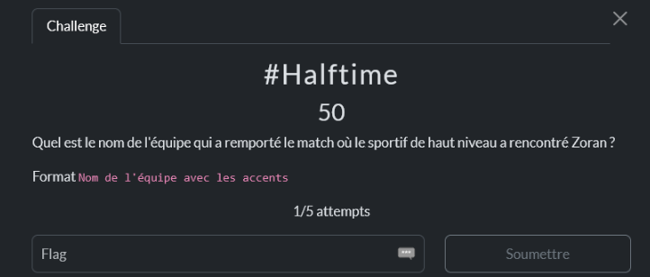

> Cette fois ci du coté d'Alec on voit qu'il parle de Hockey.

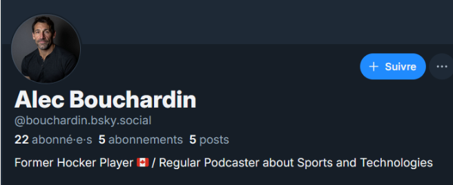

> L'homme sur l'image a l'air d'être de l'équipe des Icemen de Jacksonville et parle d'un certain Christophe Lalancette et d'une rencontre avec Zoran lors du troisième tour des séries éliminatoires.
> En recherchant ce joueur on voit qu'il appartient à l'équipe des HC ŠKODA PLZEŇ et en cherchant leur résultat lors de leur [troisième matchs](https://www.sofascore.com/fr/tournoi/hockey-sur-glace/czech-republic/extraliga/237#id:61241) on voit que c'est eux qui l'ont remporté.

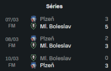

> Les deux podcaster sont donc avec Advanced Medical Systems et vont surement precher leur paroisse...

**🎯 Flag :** `HC ŠKODA PLZEŇ`

---

### 27. #PasSympa 

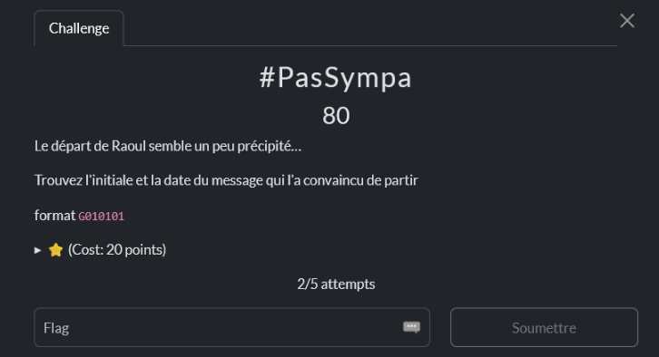

> De retour sur Raoul, mon cerveau fait tic, si j'ai pu regardé Chez le rat, pourquoi pas à l'ancienne adresse de Raoul ?
> Je la rentre sur OIW et je tombe sur les [bonnes informations](https://drive.proton.me/urls/TTCDH92BGW#u80H1wvANV4c).

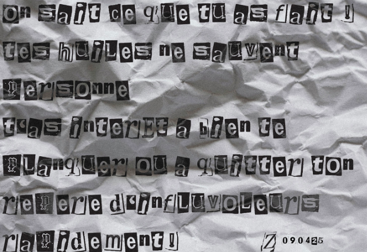

**🎯 Flag :** `Z090425`

---

### 28. #Soldes

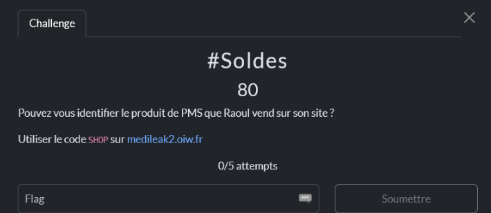

> Apres avoir découvert https://lavoixdeleurope.eu/ j'ai écouté la radio pendant 30 min pour avoir toutes les informations.
> On sait donc que Raoul à un [site internet](https://drrevel.onlineweb.shop) et que les podcaster Alec et André expriment leur avis en faveur des tchèques contre Mediprecog.
> En regardant sur le site de Raoul on peut voir la même montre que sur le Bluesky de Alec, sur [pokrocilymedicinskysystem.cz](https://pokrocilymedicinskysystem.cz/) et qui a les caractéristiques dont ils parlent dans le podcast.

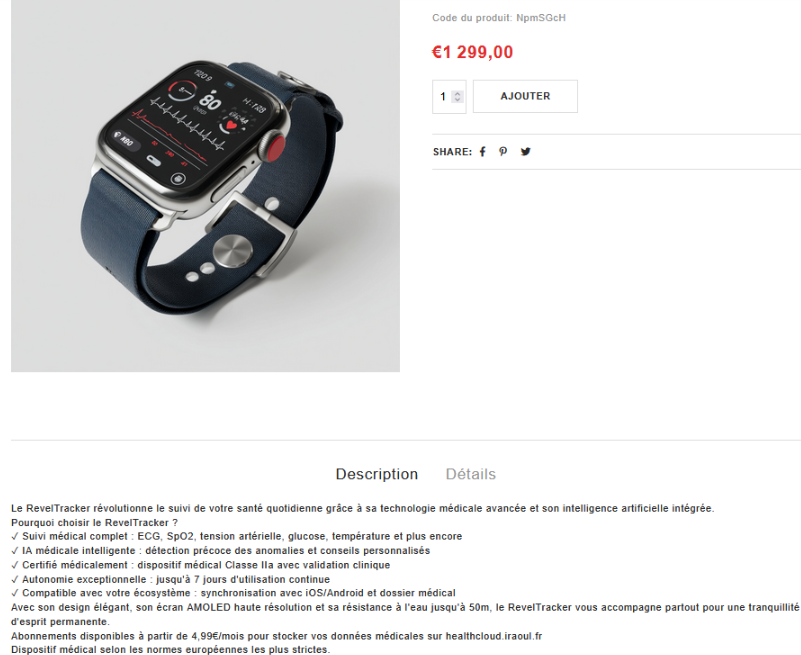

> On rentre dans OIW le code SHOP ainsi que l'image de la montre et il sort un token.

> Raoul est donc lui aussi avec Advanced Medical Systems ??

**🎯 Flag :** `7ef4f88c-fc53-4e70-8e21-49f248c45feb`

---

### 29. #AvisNégatif

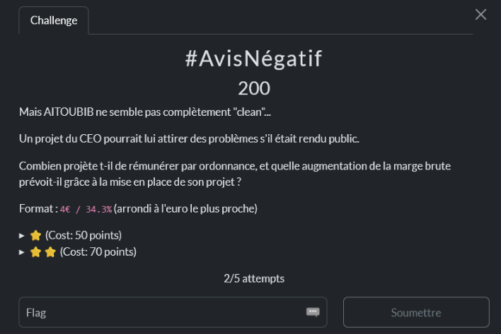

> En regardant dans le code source du site [AI Toubib](https://aitoubib.fr/) on peut voir qu'il a été fait par LVC1-F3R.
> Comme tout bonne développeuse qui se respecte cette personne à un Github (trouvable avec https://usercheck.oscarzulu.org/) et on apprend que c'est Lucie Monlucin, qu'on avait déjà vu dans des articles, ancienne CTO de Ai Toubib.

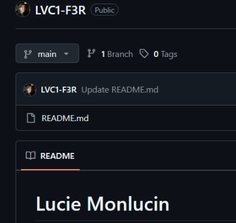

> En cherchant dans les commits on finit par trouver un OIW pour discuter avec elle

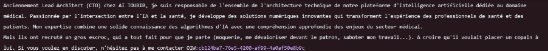

> Après quelques échanges avec elle, elle donne un lien [proton](https://drive.proton.me/urls/PRQPD201BC#VcvKWueJyu5F) qui contient les informations qu'on cherche (avec une conversion CZK -> Euros à faire)

> Dans son profil on peut voir qu'elle a été à l'IUT avec Lucas à la même période, encore une personne qui joue double-jeu ?

**🎯 Flag :** `8€ / 43.8 %`

---

### 30. #Fl4G (Bonus)

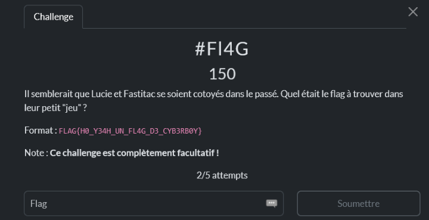

> Une fois qu'on sait qu'elle a vécu un temps avec Lucas j'ai été sur son OIW pour la questionné, elle m'a bien parlé de moment avec lui par rapport à du code mais rien qui ne donne la réponse.
> En cherchant son pseudo sur [un site](https://instantusername.com/?q=LVC1-F3R) j'ai trouvé qu'elle était sur d'autre plateforme, dont [Replit](https://replit.com/@LVC1-F3R/Eliza2?v=1#logs/conversation_20250429_134709_bllls.txt) où en cherchant dans le code, et plus précisement dans l'historique des messages j'ai fini par trouvé le bon flag.

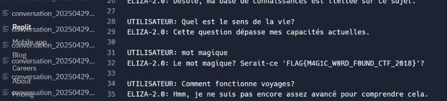

> On découvre une nouvelle personne, Rania Bouhamed, à voir s'il servira.

**🎯 Flag :** `FLAG{M4G1C_W0RD_F0UND_CTF_2018}`

---

### 31. #OldLove

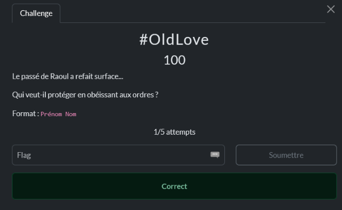

> Le passé de Raoul refait surface -> ça fait penser qu'il faut aller vérifier là où on a plein d'anciennes infos sur lui, le [write-up](https://oscarzulu.org/wu-medileak/) du Medileak 1.
> En cherchant, on trouve qu'il a encontré Gizem dans une pharmacie en stage, qu'il lui a rédigé un poème romantique, et qu'il lui vouait une loyauté dans ses mails.

**🎯 Flag :** `Gizem Ihanet`

---

### 32. #Clochint (Bonus)

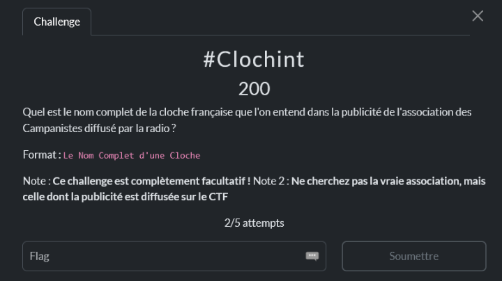

> Ici pas de stratégie particulière, j'ai écouté le [top 10 des sons de cloches](https://www.youtube.com/watch?v=asqExKVkyAw) et j'ai trouvé à l'oreille celle qui correspondait.
> Attention cependant à bien mettre le nom complet trouvable sur [Wikipedia](https://fr.wikipedia.org/wiki/La_Savoyarde) et pas son surnom utilisé.

**🎯 Flag :** `Françoise Marguerite du Sacré-Cœur de Jésus`

---

### 33. #Insécurité

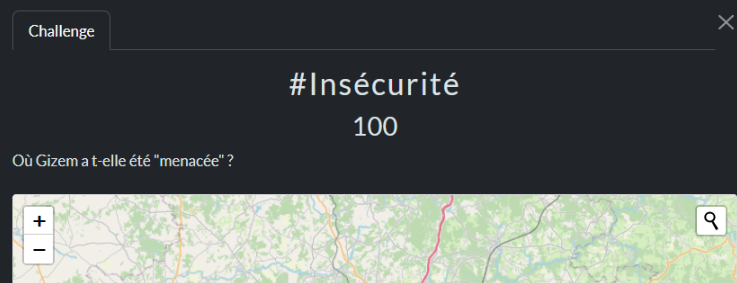

> Mauvaise compréhension de ma part j'ai cru qu'il fallait continuer de chercher dans son passé pour les menaces et donc mauvais flag car on repartait sur une attaque récente.
> On continue les recherches sur le [write-up](https://oscarzulu.org/wu-medileak/) et on voit qu'elle a un [profil Strava](https://www.strava.com/athletes/135688719?num_entries=10).
> En se connectant on voit qu'elle a été attaqué et qu'ils ont détruit son téléphone sur un chemin qu'elle avait déjà pris auparavant.

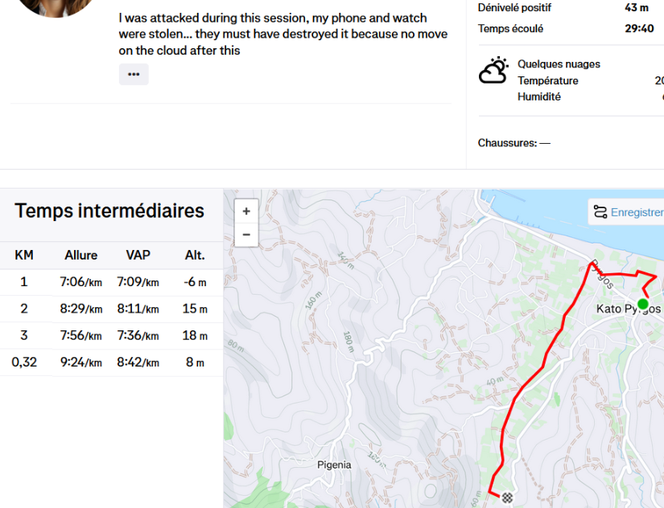

**🎯 Flag :** 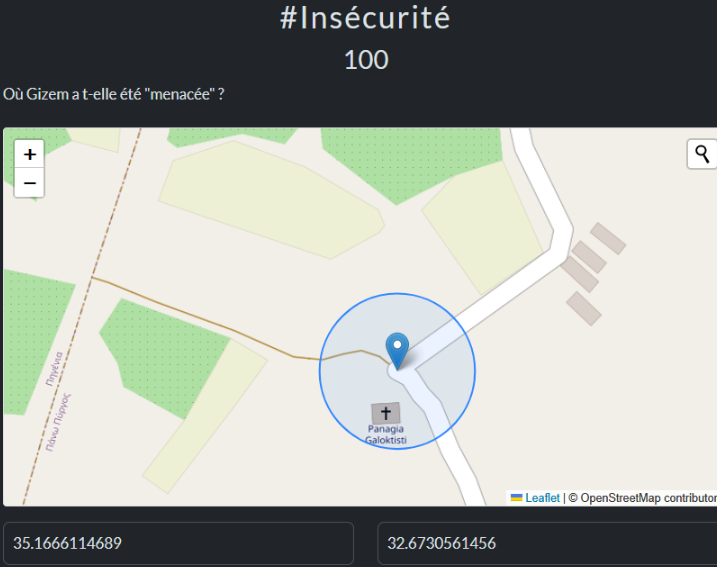

---

### 34. #LesBonsComptes

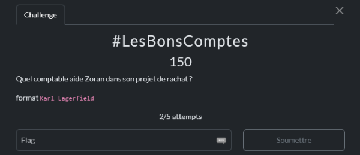

> En retournant sur [finint.ninja](https://finint.ninja/) j'ai été interpellé par le fait de voir 3 documents, j'avais déjà ouvert les 3 mais jamais encore pensé à y regarder les metadatas.
> Je teste sur les 3 et celui de Advanced Medical Systems me donne "Alisha dy compta" ainsi que son site https://alishady.eu/

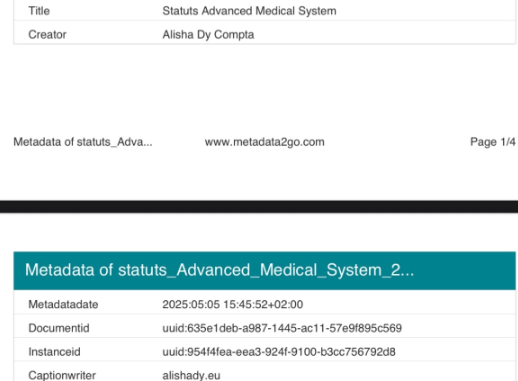

**🎯 Flag :** `Alisha Dy`

---

### 35. #Mission

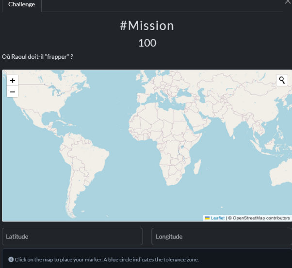

> Sur https://lavoixdeleurope.eu/ on entend à un moment un signal sonore strident d'une quarantaine de seconde qui se finit par "Pour R".
> A force d'avoir enquêter sur le Medileak et en regardant aussi le write-up du premier du nom, on sait que R a de grandes chances de signifier Raoul.
> A force de recherche sur Youtube on finit par trouver que c'est un audio qu'on peut transformer avec robot36.
> On le fait écouter à l'application et il nous donne cette image :

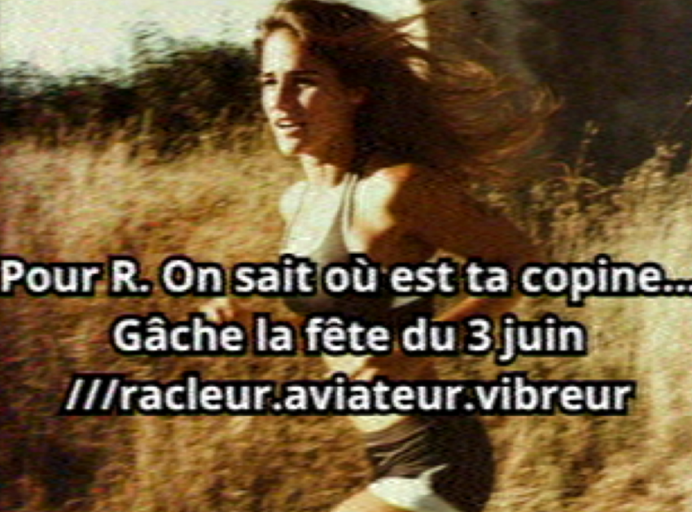

> On reconnait le format de https://what3words.com qui permet de donner une localisation avec 3 mots.

**🎯 Flag :** A Limoges 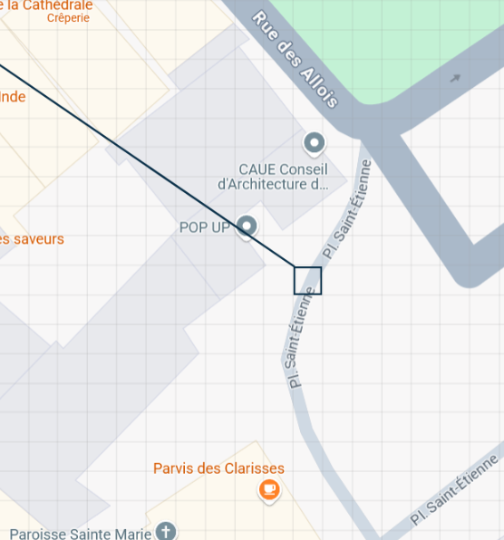

---

### 36. #IA

> (Changement de PC donc pas les mêmes couleurs)

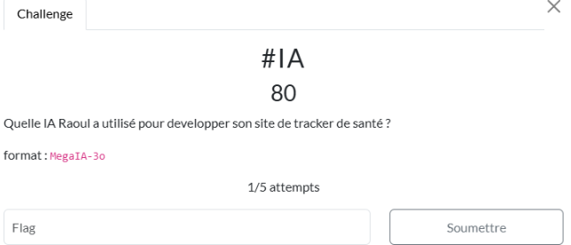

> Sur le [site de Raoul](https://drrevel.onlineweb.shop/product/reveltracker) on peut voir en bas "healthcloud.iraoul.fr" qui mène vers une page de connexion.
> Dans un premier temps on peut trouver les logs facilement en testant les plus connus et admin:admin123 fonctionne, ce qui nous permet de visiter le site.
> En guessing on voit aussi que le /.git/ est ouvert, et en fouillant dedans, sur le app.py on voit écrit "Code généré par assistant DeepSeek v3 le 20/04/2025"

**🎯 Flag :** `DeepSeek-V3`

---

### 37. #Malin

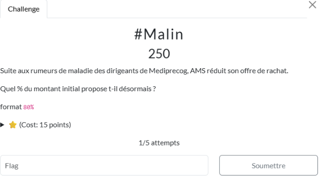

> Toujours sur le pdf d'Advanced Medical Systems, on peut aussi voir la signature JSON Web Token qui mentionne "alishady.eu:1337".
> En pivotant sur ce site https://alishady.eu:1337 on tombe sur son site web "obscur".
> On trouve un OIW pour lui parler mais qui ne m'a rien donné, et un PDF à l'adresse "https://alishady.eu:1337/assets/plaquette.pdf".
> En retournant à /assets on trouve tous les clients de Alisha, on cherche jusqu'à trouver le fichier qui parle du rachat par Advanced Medical Systems.

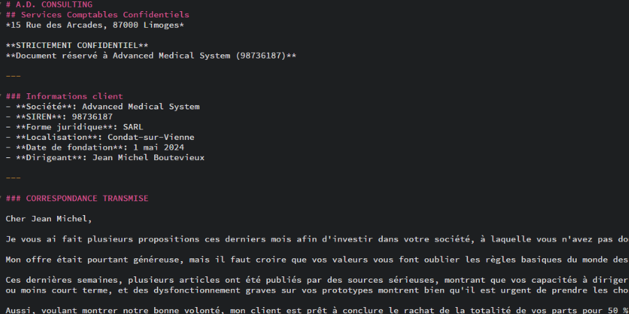

**🎯 Flag :** `50%`

---

### 38. #SoyonsDésinvoltes

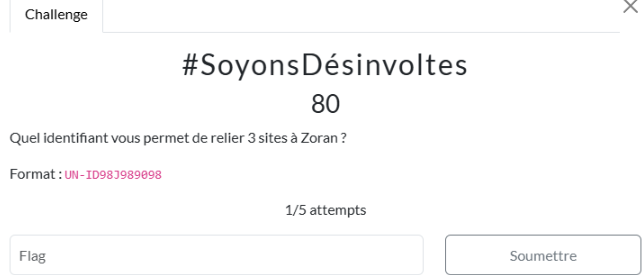

> On sait que Zoran a plusieurs sites, 3 d'entre eux étant https://medinews.tech/ , https://pokrocilymedicinskysystem.cz/ et https://lavoixdeleurope.eu/
> En cherchant dans les codes sources avec un ctrl+F sur "id", on peut voir que les 3 sites ont la même ID, et ici le même Google Tag Manager.

**🎯 Flag :** `GTM-5J4M3JV8`

---

### 39. #HomeSick

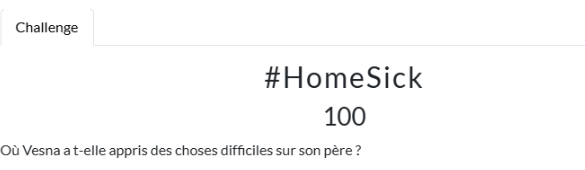

> Ici j'ai pris un indice qui m'a dit d'aller chercher du coté des avis que Vesna aurait pu laisser.
> En reprenant son pseudo [Bluesky](https://bsky.app/profile/vesnadvorak.bsky.social), avec [IDCrawler](https://www.idcrawl.com/u/vesnadvorak) on trouve qu'elle a un [TripAdvisor](https://www.tripadvisor.com/Profile/VesnaDvorak?tab=reviews&fid=e4a26390-7353-4143-b5f6-02eba1f22b83) !
> On traduit ce qu'elle a dit et on voit qu'elle a parlé avec son père à la Chapelle Saint Aurélien de Limoges.

**🎯 Flag :** 

---

### 40. #END

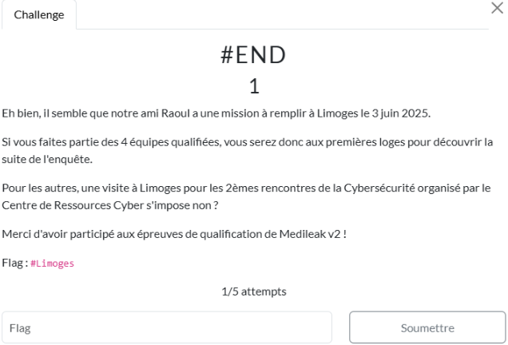

**🎯 Flag :** `#Limoges`

---

## Tous les challenges

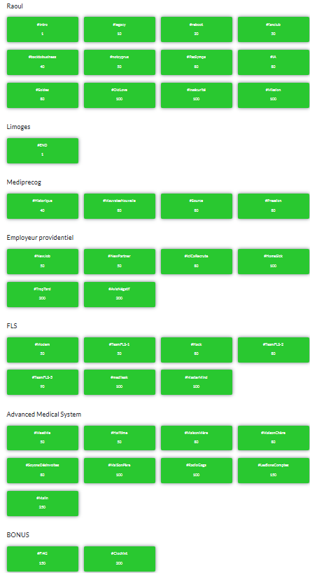

---

## Toutes les techniques utilisées

Voici un récapitulatif exhaustif des techniques, outils, sites et pivots utilisés tout au long du CTF :

### 🌐 OSINT web & recherche en profondeur

- Recherche de pseudonymes et identités sur :
  - [usercheck.oscarzulu.org](https://usercheck.oscarzulu.org)
  - [idcrawl.com](https://idcrawl.com/)
  - [instantusername.com](https://instantusername.com)
- Recherche sur les réseaux sociaux : TikTok, Bluesky, Steam, Strava, TripAdvisor
- Exploration de sites de news OSINT : [mednews.tech](https://mednews.tech)
- Exploration de write-ups précédents (ex : [Medileak 1](https://oscarzulu.org/wu-medileak/))
- Lecture attentive de sites d’entreprise pour découvrir des liens ou changements :
  - Pages "Actualités"
  - Mentions légales
  - Filtres `robots.txt`, `/.git/`, `/assets/`, `/logs/`

---

### 🕸️ Analyse technique & investigation réseau

- Exploration de répertoires `.git/` ouverts et analyse de `app.py`
- Telnet vers une IP trouvée pour lire une messagerie texte
- Analyse de JWT signés dans des PDF
- Décodage SSTV via l’application [Robot36](https://play.google.com/store/apps/details?id=xdsopl.robot36)
- Extraction de métadonnées dans des documents PDF/JSON
- Guessing de mots-clés sur interface (`xsf`, `bbs`, etc.)
- Recherche dans les commits GitHub pour identifier OIW, auteurs ou artefacts

---

### 🔎 Analyse de code source / dev

- Analyse de signatures Google Tag Manager (GTM)
- Détection d’ID ou variables partagées entre sites
- Lecture directe du code HTML/JS (ex : DeepSeek mentionné dans `app.py`)
- Pivot sur signatures de développeurs (`LVC1-F3R`, `DeepSeek-V3`)

---

### 🌍 Géolocalisation & investigation physique

- Recherche inversée d’images (Google, Yandex)
  - Ex : Tour Al Manara, Damac Zada Tower
- Croisement TikTok + date + métadonnées vidéo pour reconstituer un trajet
- Recherche de vols (ex : EK73)
- Détection d’objets récurrents (ex : montre connectée sur plusieurs supports)
- Utilisation de [What3words](https://what3words.com/)
- [Google Maps](https://maps.google.com) + Street View

---

### 🔗 Pivots entre entités / personnes

- Cross-pivoting entreprise/personne via [finint.ninja](https://finint.ninja)
- Identification d’actionnaires, employés, liens historiques
- Croisements de relations (anciens collègues, camarades, réseaux sociaux)
- Détection de doubles affiliations (Raoul, Lucas, Lucie, etc.)
- Analyse de signatures ou mentions légales

---

### 🧩 Utilisation de plateformes spécialisées

- [WebCheck](https://web-check.xyz) pour révéler des connexions entre sites
- **OIW** (Open Intelligence Wall) : tokens, dialogues avec PNJ, codes lieux
- IPFS : exploration de fichiers hébergés via `bafy...`
- [GitLab](https://gitlab.com), [Replit](https://replit.com) pour explorer logs, historiques de projets
- Plateformes sociales secondaires : Steam, TripAdvisor, Strava, Bluesky

---

### 🎧 Médias & sons

- Analyse de podcasts (ex : discours pro-AMS)
- Repérage d’infos dans les dialogues audio
- Décodage de signal SSTV avec [Robot36](https://robot36.com)

---

### 📁 Dossiers & documents

- Exploration de répertoires `/assets/`, `/logs/`, `/replays/`, `/history/`
- Fichiers détectés :
  - Plaquettes commerciales
  - Rapports clients
  - Achats, devis, contrats
- Métadonnées dans PDF, CSV
- Fichiers hébergés sur Proton Drive, Replit, IPFS

---

### 🧠 Stratégies spécifiques

- Guessing intelligent d’URL (ex : `pokrocilymedicinskysystem.cz`)
- Conversion CZK → EUR pour comprendre un flag
- Recherche sur `.bsky.social` à partir de noms
- Écoute attentive + comparaison manuelle (ex : sons de cloche sur YouTube)

---

### 🧪 Techniques OSINT mobilisées

- **OSINT Humain** : relations, identités, doubles jeux
- **OSINT Réseau** : fichiers `.git`, JWT, Telnet, IPs
- **OSINT Entreprise** : analyse financière & historique (finint.ninja)
- **OSINT Média** : TikTok, podcast, vidéo, SSTV
- **OSINT Documents** : PDF, métadonnées, commits, logs
- **OSINT Lieu** : Strava, TripAdvisor, What3words, TikTok, Google Maps
- **Social Engineering passif** : interprétation de dialogues OIW & comportements

---
